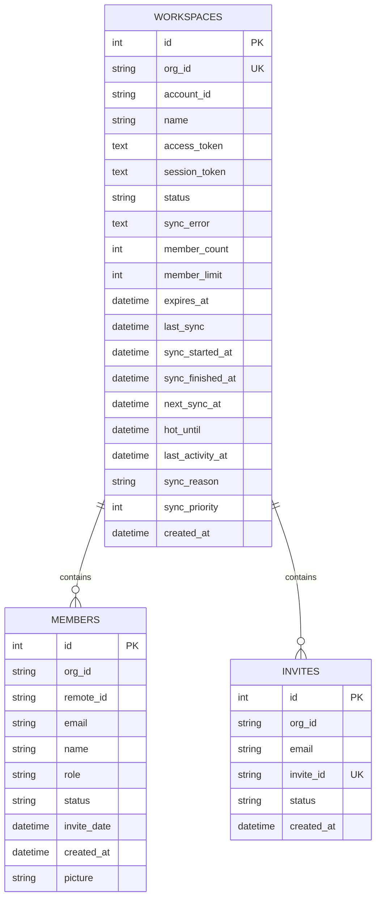
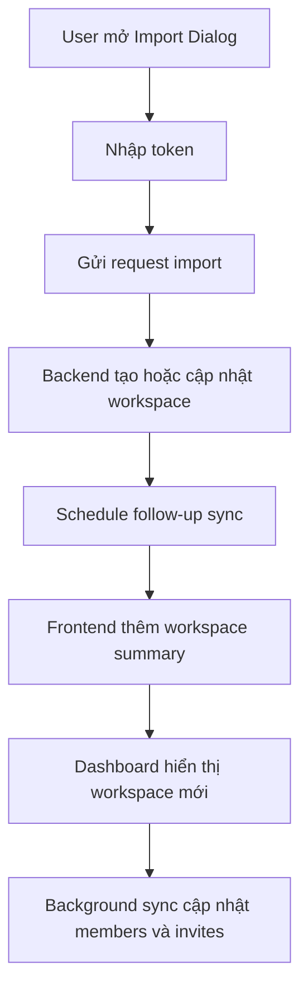
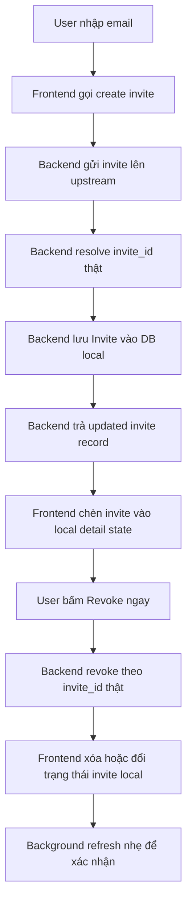
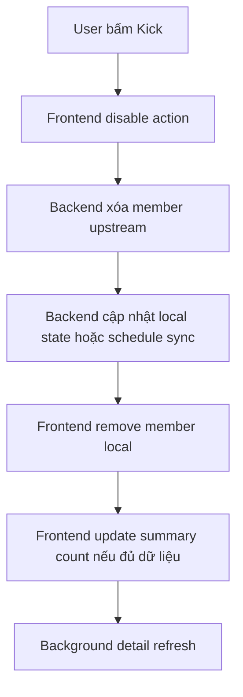
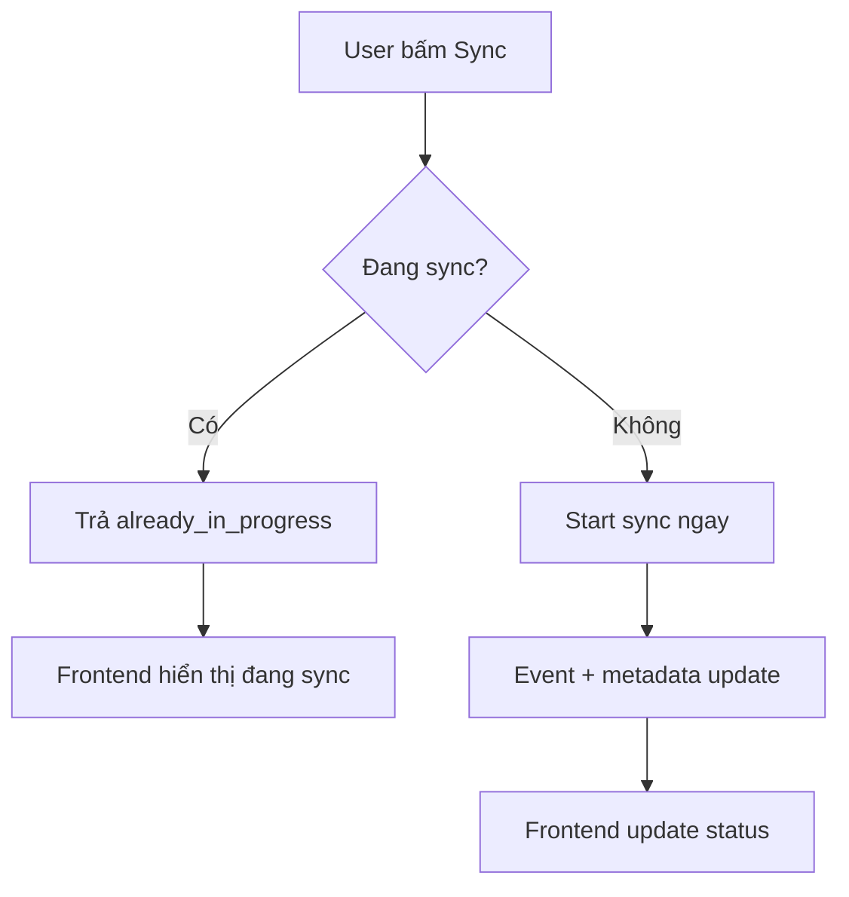

# 🎨 DESIGN: ChatGPT Team Manager Optimization

Ngày tạo: 2026-03-12 18:16 +07:00  
Dựa trên:
- [BRIEF.md](file:///c:/Users/DungLee/Documents/laptrinh/laptrinh/code/LinhTinh/tool_manage_chatgptTeam/docs/BRIEF.md)
- [plan.md](file:///c:/Users/DungLee/Documents/laptrinh/laptrinh/code/LinhTinh/tool_manage_chatgptTeam/plans/260312-1809-project-optimization/plan.md)
- [project_optimization_spec.md](file:///c:/Users/DungLee/Documents/laptrinh/laptrinh/code/LinhTinh/tool_manage_chatgptTeam/docs/specs/project_optimization_spec.md)

---

## 1. Mục tiêu của bản thiết kế

Bản thiết kế này trả lời câu hỏi:

> **Tối ưu hệ thống hiện tại như thế nào để vừa đúng, vừa mượt, vừa dễ bảo trì?**

Trọng tâm không phải là làm thêm nhiều tính năng mới, mà là:
- làm cho flow đúng trong thực tế
- giảm nhu cầu F5 thủ công
- tăng độ tin cậy của dữ liệu
- giảm sự chồng chéo giữa backend sync, frontend state và event realtime
- làm cho code dễ hiểu hơn trước khi tiếp tục mở rộng

---

## 2. Cách lưu thông tin (Data Design)

### 2.1. Giải thích đơn giản

Hệ thống hiện tại giống như có 3 “sheet Excel” chính:

1. **Workspace** → lưu thông tin từng team/workspace
2. **Member** → lưu danh sách thành viên của từng workspace
3. **Invite** → lưu các lời mời đang chờ hoặc đã xử lý

Ngoài dữ liệu chính, hệ thống còn lưu thêm các cột để biết:
- workspace có đang đồng bộ không
- đồng bộ lần cuối khi nào
- có lỗi gì không
- nên đồng bộ tiếp lúc nào

Điểm quan trọng:
- **DB local không phải bản sao vô nghĩa**, mà là lớp dữ liệu vận hành để dashboard hiển thị nhanh
- nhưng DB local cũng **không được phép bịa ra dữ liệu nghiệp vụ**

---

### 2.2. Sơ đồ dữ liệu hiện tại



---

### 2.3. Ý nghĩa từng bảng

#### A. `workspaces`
Đây là bảng “tổng quan đội nhóm”.

Lưu:
- team nào đang được quản lý
- tên team
- giới hạn số member
- ngày hết hạn
- các mốc sync
- tình trạng sync hiện tại

**Vai trò trong UI:**
- dùng để vẽ dashboard summary list
- quyết định workspace nào đang hot, đang lỗi, hoặc cần sync tiếp

#### B. `members`
Đây là bảng “chi tiết người trong team”.

Lưu:
- thành viên thuộc workspace nào
- email, tên, role
- trạng thái hiện tại
- ngày tham gia / ngày mời nếu có

**Vai trò trong UI:**
- dùng để render member table
- dùng để tính quyền hiện tại của user đang cầm token

#### C. `invites`
Đây là bảng “lời mời đang tồn tại trong local DB”.

Lưu:
- email được mời
- invite_id thật
- trạng thái pending/cancelled/... 
- created_at

**Vai trò trong UI:**
- dùng để hiển thị pending invites
- hỗ trợ revoke/resend ngay trên dashboard

---

### 2.4. Rule thiết kế dữ liệu

#### Rule 1 — Không dùng ID giả cho flow thật
Ví dụ invite vừa tạo:
- nếu chưa có `invite_id` thật thì không được xem như một record fully-confirmed
- nếu backend trả record thật thì frontend mới được dùng record đó cho revoke ngay

#### Rule 2 — `workspaces` là summary, `members/invites` là detail
- `workspaces` dùng cho danh sách tổng quan
- `members` + `invites` dùng cho detail của từng org
- tránh để frontend cập nhật nhầm summary và detail theo 2 logic khác nhau mà không có rule

#### Rule 3 — Sync metadata là dữ liệu hạng nhất
Các cột như:
- `last_sync`
- `sync_started_at`
- `sync_finished_at`
- `next_sync_at`
- `sync_reason`
- `sync_priority`

không phải dữ liệu phụ, mà là phần trung tâm để quyết định UX và debug.

---

### 2.5. Ma trận “nguồn sự thật”

| Nhóm dữ liệu | Nguồn sự thật | Khi cập nhật | Frontend nên làm gì |
|---|---|---|---|
| Workspace summary | `workspaces` + sync metadata | Sau mutation hoặc sync | Update targeted, tránh full reload |
| Members list | `members` | Sau sync hoặc detail refresh | Có thể optimistic remove tạm thời |
| Pending invites | `invites` | Sau mutation + follow-up sync | Nếu có record thật thì update local ngay |
| Current user role | Mapping token + `members` | Sau sync member data | Không tự suy diễn ở UI |
| Sync status | Sync metadata | Realtime + scheduled follow-up | Hiển thị trạng thái rõ ràng |

---

## 3. Các màn hình cần làm / cần tối ưu

Dự án hiện tại không cần thêm nhiều trang mới. Trọng tâm là làm tốt các màn hình đang có.

### 3.1. Dashboard chính

```text
┌────────────────────────────────────────────────────────────┐
│  🏠 DASHBOARD                                             │
│  Mục đích: Xem toàn bộ workspaces và thao tác nhanh       │
│                                                           │
│  Hiển thị:                                                │
│  - Danh sách workspace                                    │
│  - Trạng thái sync                                        │
│  - Member count / limit                                   │
│  - Pending invites                                        │
│  - Expires at                                             │
│                                                           │
│  Thao tác:                                                │
│  - Import workspace                                       │
│  - Sync workspace                                         │
│  - Xem detail member/invite                               │
│  - Delete workspace                                       │
└────────────────────────────────────────────────────────────┘
```

### 3.2. Workspace detail zone

```text
┌────────────────────────────────────────────────────────────┐
│  📦 WORKSPACE DETAIL                                      │
│  Mục đích: Xem và quản lý 1 workspace cụ thể              │
│                                                           │
│  Bao gồm:                                                 │
│  - Dashboard summary card                                 │
│  - Member table                                           │
│  - Invite panel                                           │
│  - Invite list                                            │
└────────────────────────────────────────────────────────────┘
```

### 3.3. Import dialog

```text
┌────────────────────────────────────────────────────────────┐
│  ➕ IMPORT DIALOG                                         │
│  Mục đích: Nhập workspace mới từ token                    │
│                                                           │
│  Input:                                                   │
│  - access token hoặc session token                        │
│  - org_id / name (nếu cần fallback)                       │
│                                                           │
│  Kết quả mong muốn:                                       │
│  - tạo workspace summary thành công                       │
│  - schedule follow-up sync                                │
│  - dashboard thấy workspace mới ngay                      │
└────────────────────────────────────────────────────────────┘
```

---

## 4. Thiết kế trách nhiệm giữa frontend và backend

### 4.1. Backend chịu trách nhiệm gì?

Backend phải chịu trách nhiệm cho phần “kết quả thật”:
- xác nhận action thành công hay chưa
- trả record thật / summary thật nếu có
- xử lý fallback khi upstream thiếu dữ liệu
- quyết định schedule sync tiếp theo
- phát event trạng thái khi cần

### 4.2. Frontend chịu trách nhiệm gì?

Frontend phải chịu trách nhiệm cho phần “trải nghiệm mượt”:
- hiển thị nhanh
- update local có kiểm soát
- không chặn UI quá mức
- giải thích trạng thái rõ ràng cho user

### 4.3. Frontend không nên làm gì?

Frontend **không nên**:
- tự sinh ID nghiệp vụ
- tự suy ra state “đã đồng bộ” khi backend chưa xác nhận
- full refresh quá nhiều vì sẽ làm app đúng nhưng chậm

---

## 5. Thiết kế state frontend

### 5.1. Mô hình state đề xuất

Thay vì dồn hết vào `page.tsx`, state nên được chia như sau:

```text
page.tsx
 ├─ useWorkspaceList()
 ├─ useWorkspaceDetails(orgId)
 ├─ useWorkspaceActions()
 └─ useWorkspaceEvents()
```

### 5.2. Ý nghĩa từng hook

#### `useWorkspaceList()`
Quản lý:
- danh sách workspace summary
- loading danh sách
- refresh list targeted

#### `useWorkspaceDetails(orgId)`
Quản lý:
- members của org
- invites của org
- loadedMembers / syncing detail
- targeted refresh cho 1 workspace

#### `useWorkspaceActions()`
Quản lý:
- sync
- invite
- resend invite
- revoke invite
- kick member
- delete workspace
- import workspace

Hook này sẽ nhận response từ backend và quyết định:
- local update ngay
- invalidate detail
- invalidate list
- hay chờ sync/event

#### `useWorkspaceEvents()`
Quản lý:
- kết nối SSE
- lắng nghe event
- map event thành invalidate/update nhỏ
- tránh full reload mặc định

---

### 5.3. Rule update state

#### Loại A — Local-safe
Ví dụ:
- revoke invite có response rõ
- invite create trả về `invite` thật

=> frontend được phép update local ngay

#### Loại B — Local-safe + detail refresh
Ví dụ:
- kick member

=> frontend có thể remove local ngay để UI mượt, nhưng vẫn nên refresh detail nền để xác nhận

#### Loại C — List-affecting
Ví dụ:
- delete workspace
- import workspace

=> cần update summary list và có thể invalidate list nền

#### Loại D — Sync-driven
Ví dụ:
- manual sync workspace

=> local chỉ update trạng thái “syncing”, data đầy đủ sẽ đến sau sync/event

---

## 6. Luồng hoạt động chính

### 6.1. Hành trình 1 — Import workspace mới



#### Điều user mong đợi
- import xong thấy workspace ngay
- không cần chờ đủ member/invite mới nhìn thấy summary
- nhưng vẫn biết dữ liệu detail có thể đang trong quá trình đồng bộ

---

### 6.2. Hành trình 2 — Gửi invite rồi revoke ngay



#### Chỗ dễ lỗi nếu thiết kế sai
- dùng ID giả
- frontend chỉ tăng số lượng pending nhưng không có record thật
- refresh quá muộn hoặc quá mạnh

---

### 6.3. Hành trình 3 — Kick member



#### Mục tiêu UX
- thấy member biến mất ngay
- không phải chờ full reload
- nhưng count cuối cùng vẫn đúng với dữ liệu local DB/sync

---

### 6.4. Hành trình 4 — Manual sync khi workspace đang sync



#### Mục tiêu UX
- không tạo cảm giác bấm không ăn
- nếu đang sync thì phải báo rõ
- không đẩy dashboard vào vòng refresh lặp vô ích

---

## 7. Thiết kế event và refresh policy

### 7.1. Event nên làm gì?

Event nên dùng để:
- cập nhật trạng thái sync cục bộ
- báo workspace đang hot / scheduled / synced / error
- yêu cầu invalidate list hoặc detail nếu cần

### 7.2. Event không nên làm gì?

Event **không nên** mặc định:
- ép full reload toàn dashboard
- ghi đè local state mới hơn bằng dữ liệu cũ hơn
- thay thế vai trò của backend mutation response

### 7.3. Decision table

| Tình huống | Local update ngay | Refresh detail | Refresh list | Chờ event/sync |
|---|---:|---:|---:|---:|
| Create invite có record thật | ✅ | ✅ nền | ❌ | ✅ phụ |
| Revoke invite | ✅ | ✅ nền | ❌ | ✅ phụ |
| Kick member | ✅ | ✅ nền | Có thể | ✅ phụ |
| Import workspace | ✅ summary | ❌ ngay | ✅ | ✅ |
| Manual sync | ❌ data | Có | Có | ✅ chính |
| Delete workspace | ✅ | ❌ | ✅ | ❌ |

---

## 8. Danh sách component / mảnh ghép giao diện

| Component | Vai trò | Cần tối ưu gì |
|---|---|---|
| `workspace-card.tsx` | Hiển thị summary từng workspace | bớt nhận quá nhiều props động |
| `dashboard-summary.tsx` | Tóm tắt số liệu / trạng thái | rõ hơn về sync status |
| `member-table.tsx` | Hiển thị và thao tác member | tối ưu sort + busy state |
| `invite-panel.tsx` | Gửi invite mới | trả record thật về parent |
| `invite-list.tsx` | Danh sách pending invite | revoke/resend state rõ ràng |
| `import-dialog.tsx` | Import workspace | feedback tiến trình rõ hơn |

---

## 9. Checklist kiểm tra (Acceptance Criteria)

### 9.1. Tính năng: Import workspace

#### Cơ bản
- [ ] Nhập token hợp lệ → import thành công
- [ ] Workspace mới xuất hiện ngay trong dashboard
- [ ] Không cần F5 để thấy workspace vừa import

#### Nâng cao
- [ ] Nếu token trả nhiều accounts → hiển thị/import đầy đủ
- [ ] Nếu thiếu access token nhưng có session token → backend vẫn xử lý refresh token đúng
- [ ] Sau import có follow-up sync hợp lệ

#### Trải nghiệm
- [ ] User hiểu rõ workspace mới đang “đã import” hay “đang sync detail”
- [ ] Không có full reload nặng ngay sau import

---

### 9.2. Tính năng: Create invite

#### Cơ bản
- [ ] Gửi invite thành công với email hợp lệ
- [ ] Invite mới xuất hiện trong danh sách pending
- [ ] Pending invite count được cập nhật

#### Nâng cao
- [ ] Backend resolve được `invite_id` thật nếu upstream không trả ID trực tiếp
- [ ] Response trả về record đủ để frontend update local ngay
- [ ] Không cần full refresh mới thấy record usable

#### Trải nghiệm
- [ ] Form báo rõ đang gửi / thành công / lỗi
- [ ] Không cho spam gửi nhiều lần liên tiếp cùng lúc

---

### 9.3. Tính năng: Revoke invite

#### Cơ bản
- [ ] Có thể revoke invite đang pending
- [ ] Invite biến mất hoặc đổi trạng thái ngay trên UI

#### Nâng cao
- [ ] Vừa tạo invite xong vẫn revoke ngay được
- [ ] Nếu backend fail thì UI rollback đúng hoặc báo lỗi rõ
- [ ] Sau refresh nền, trạng thái vẫn nhất quán

#### Trải nghiệm
- [ ] Nút bị disable trong lúc đang xử lý
- [ ] User không thấy trạng thái “ảo” kéo dài

---

### 9.4. Tính năng: Kick member

#### Cơ bản
- [ ] Bấm kick → member bị loại khỏi danh sách
- [ ] Không cần F5 để thấy thay đổi

#### Nâng cao
- [ ] Seat usage / member count cập nhật đúng theo rule
- [ ] Nếu backend fail, local optimistic update được phục hồi hoặc refresh lại đúng

#### Trải nghiệm
- [ ] Không click lặp trong lúc đang xử lý
- [ ] Feedback rõ ràng sau thao tác

---

### 9.5. Tính năng: Sync workspace

#### Cơ bản
- [ ] Bấm sync → trạng thái chuyển sang đang sync
- [ ] Sau sync, dữ liệu member/invite được làm mới

#### Nâng cao
- [ ] Nếu workspace đã sync sẵn thì trả trạng thái đang chạy thay vì bấm “không có gì xảy ra”
- [ ] Event và refresh không chồng chéo gây reload thừa

#### Trải nghiệm
- [ ] User nhìn vào biết đang sync, lỗi hay xong
- [ ] Dashboard không khựng mạnh khi sync nhiều thao tác liên tiếp

---

## 10. Test Cases Outline

### TC-01: Invite happy path
**Given:** Workspace đã load detail, user có quyền mời  
**When:** Gửi invite với email hợp lệ  
**Then:**
- ✓ Backend trả invite record thật
- ✓ UI chèn record vào local state
- ✓ Pending count tăng đúng

### TC-02: Invite create rồi revoke ngay
**Given:** Vừa tạo invite thành công  
**When:** Bấm revoke ngay, không reload trang  
**Then:**
- ✓ Backend nhận đúng `invite_id` thật
- ✓ Revoke thành công
- ✓ UI cập nhật đúng không cần F5

### TC-03: Revoke fail path
**Given:** Invite đang pending nhưng upstream lỗi  
**When:** User bấm revoke  
**Then:**
- ✓ UI không giữ trạng thái giả quá lâu
- ✓ Có thông báo lỗi rõ ràng
- ✓ Có refresh hoặc rollback hợp lý

### TC-04: Kick member happy path
**Given:** Member đang hiện trong bảng  
**When:** User bấm kick  
**Then:**
- ✓ Member biến mất ngay
- ✓ Summary/detail cuối cùng đồng nhất

### TC-05: Manual sync while already syncing
**Given:** Workspace đang sync  
**When:** User bấm sync thêm lần nữa  
**Then:**
- ✓ Backend trả `already_in_progress`
- ✓ UI báo trạng thái đúng
- ✓ Không phát sinh request/sync loop vô ích

### TC-06: Import workspace
**Given:** User có token hợp lệ  
**When:** Import workspace mới  
**Then:**
- ✓ Workspace summary hiện ngay
- ✓ Follow-up sync được lên lịch
- ✓ UI không cần full reload nặng

### TC-07: Event arrives after local optimistic update
**Given:** UI đã update local sau action  
**When:** Event SSE tới trễ hơn  
**Then:**
- ✓ Event không làm dữ liệu mới bị ghi đè sai
- ✓ Chỉ invalidate đúng scope cần thiết

---

## 11. Đề xuất cấu trúc code sau khi refactor

```text
frontend/src/
├─ app/
│  └─ page.tsx
├─ hooks/
│  ├─ use-workspace-list.ts
│  ├─ use-workspace-details.ts
│  ├─ use-workspace-actions.ts
│  └─ use-workspace-events.ts
├─ components/
│  ├─ workspace-card.tsx
│  ├─ dashboard-summary.tsx
│  ├─ member-table.tsx
│  ├─ invite-panel.tsx
│  ├─ invite-list.tsx
│  └─ import-dialog.tsx
└─ lib/
   └─ api.ts
```

```text
backend/app/
├─ routers/
│  ├─ workspaces.py
│  └─ invites.py
├─ services/
│  ├─ chatgpt.py
│  ├─ workspace_sync.py
│  ├─ invite_service.py          (đề xuất thêm)
│  ├─ member_service.py          (đề xuất thêm)
│  └─ workspace_service.py       (đề xuất thêm)
└─ models.py
```

---

## 12. Quyết định thiết kế quan trọng

### Quyết định 1
**Mutation response phải giàu thông tin hơn hiện tại.**  
Lý do: để frontend update đúng ngay, giảm phụ thuộc refresh mù.

### Quyết định 2
**`page.tsx` không nên tiếp tục là nơi ôm toàn bộ orchestration.**  
Lý do: quá khó kiểm soát correctness + performance cùng lúc.

### Quyết định 3
**Sync metadata là một phần của UX, không chỉ là debug data.**  
Lý do: user cần hiểu hệ thống đang làm gì.

### Quyết định 4
**Optimistic update chỉ dùng khi có rule rollback/confirm rõ.**  
Lý do: tránh UI trông đúng nhưng dữ liệu thực tế sai.

---

## 13. Kết luận

Thiết kế đề xuất cho dự án này là:

- backend trả dữ liệu action rõ hơn
- sync engine có rule rõ hơn
- frontend tách state theo trách nhiệm
- event chỉ hỗ trợ cập nhật, không thay thế nguồn sự thật
- acceptance criteria và test cases được viết trước để tránh refactor cảm tính

Nếu bám đúng bản thiết kế này, dự án sẽ tiến dần từ:

> **“chạy được nhưng còn khựng và đôi lúc lệch”**

thành:

> **“quản lý team nhanh, đúng, và đáng tin trong thực tế”**

---

*Tạo bởi AWF - Design Phase*
