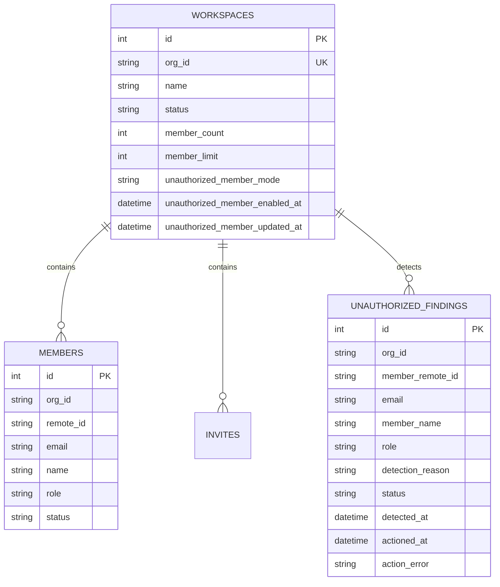
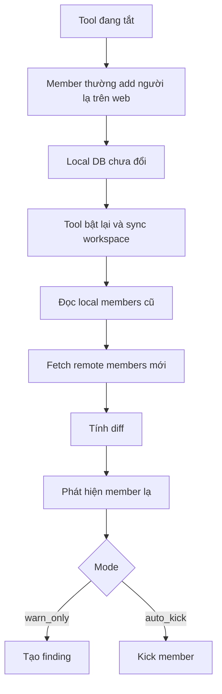
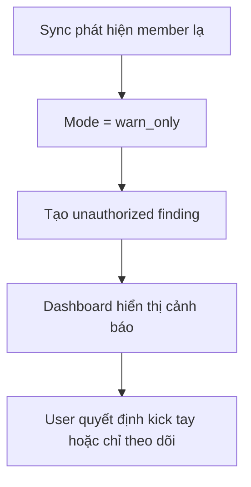
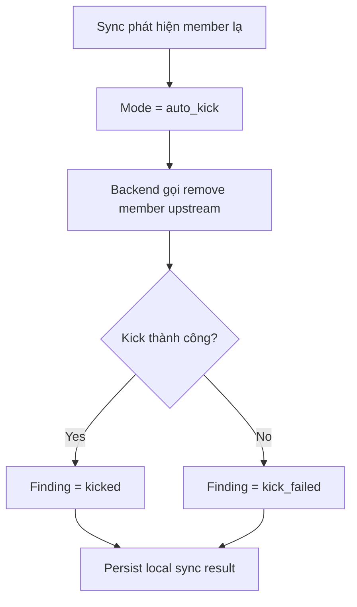

# 🎨 DESIGN: Auto Kick Unauthorized Member

Ngày tạo: 2026-04-03 05:03 +07:00  
Dựa trên:

- [plan.md](file:///C:/Users/DungLee/Documents/laptrinh/laptrinh/code/LinhTinh/tool_manage_chatgptTeam/plans/260403-0456-auto-kick-unauthorized-member/plan.md)
- [auto_kick_unauthorized_member_spec.md](file:///C:/Users/DungLee/Documents/laptrinh/laptrinh/code/LinhTinh/tool_manage_chatgptTeam/docs/specs/auto_kick_unauthorized_member_spec.md)
- [models.py](file:///C:/Users/DungLee/Documents/laptrinh/laptrinh/code/LinhTinh/tool_manage_chatgptTeam/backend/app/models.py)
- [workspace_sync.py](file:///C:/Users/DungLee/Documents/laptrinh/laptrinh/code/LinhTinh/tool_manage_chatgptTeam/backend/app/services/workspace_sync.py)

---

## 1. Mục tiêu của bản thiết kế

Bản thiết kế này trả lời câu hỏi:

> **Làm thế nào để phát hiện và xử lý member lạ dựa trên local DB, mà không cần biết ai là người mời?**

Nguyên tắc đã chốt:

- Local DB trước sync là **danh sách member hợp lệ**.
- Anh chỉ add member hợp lệ qua tool.
- Ai xuất hiện trên upstream nhưng không có trong local DB cũ thì là **unauthorized member**.

Nói kiểu đời thường:

- local DB là **danh sách người được phép có mặt trong team**,
- sync là lúc mình đi điểm danh lại,
- ai có mặt nhưng không có tên trong sổ thì bị đánh dấu là người lạ.

---

## 2. Cách lưu thông tin

### 2.1. Giải thích đơn giản

Hiện hệ thống đã có 3 “sheet Excel” chính:

1. `workspaces` → thông tin từng team
2. `members` → danh sách thành viên local
3. `invites` → lời mời

Để làm feature này, cần thêm **2 nhóm dữ liệu mới**:

1. **Policy của workspace**: workspace đó đang tắt, chỉ cảnh báo, hay tự kick
2. **Unauthorized findings**: danh sách member lạ đã bị phát hiện

---

### 2.2. Sơ đồ lưu trữ đề xuất



---

### 2.3. Chọn cách lưu: thêm cột hay thêm bảng?

## A. Trong `workspaces`

Nên thêm trực tiếp các cột sau:

- `unauthorized_member_mode`
- `unauthorized_member_enabled_at`
- `unauthorized_member_updated_at`

### Lý do

Vì đây là **setting gắn với từng workspace**, không cần tách bảng riêng ở phase đầu.

### Giá trị đề xuất

- `off`
- `warn_only`
- `auto_kick`

---

## B. Tạo bảng mới `unauthorized_findings`

### Cột đề xuất

- `id`
- `org_id`
- `member_remote_id` (nullable)
- `email`
- `member_name` (nullable)
- `role`
- `detection_reason`
- `status`
- `detected_at`
- `actioned_at` (nullable)
- `action_error` (nullable)

### `status` đề xuất

- `detected`
- `kicked`
- `kick_failed`
- `trusted`
- `ignored`
- `already_removed`

### `detection_reason` phase đầu

- `not_in_local_before_sync`

---

### 2.4. Rule dữ liệu quan trọng

#### Rule 1 — Local snapshot phải chụp trước sync

Nếu không chụp trước mà xóa local members rồi ghi lại remote members luôn, thì feature sẽ mất tác dụng.

#### Rule 2 — So sánh bằng email đã normalize

Dùng:

- `trim()`
- `lower()`

Ưu tiên khóa so sánh chính:

- `email`

Khóa phụ để log/debug:

- `remote_id`

#### Rule 3 — Unauthorized finding nên được lưu lại

Không nên chỉ tính tạm rồi quên ngay, vì:

- dashboard cần hiển thị,
- cần xem lịch sử detect/kick fail,
- cần debug false positive.

#### Rule 4 — Sau khi kick fail, finding không được mất

Nếu upstream remove lỗi, finding phải chuyển sang `kick_failed`, không được biến mất khỏi UI.

---

### 2.5. Ma trận “nguồn sự thật”

| Nhóm dữ liệu          | Nguồn sự thật                     | Khi cập nhật         | Frontend nên làm gì  |
| --------------------- | --------------------------------- | -------------------- | -------------------- |
| Workspace policy mode | `workspaces`                      | Khi user đổi setting | update targeted      |
| Member whitelist      | `members` trước sync              | trước mỗi sync       | không tự suy luận    |
| Unauthorized findings | `unauthorized_findings`           | sau detect / kick    | hiển thị đúng status |
| Member count summary  | `workspaces.member_count`         | sau sync             | sync summary nhẹ     |
| Kick result           | finding status + backend response | sau enforcement      | hiện rõ success/fail |

---

## 3. Thiết kế backend

### 3.1. Luồng sync mới

Hiện tại trong [workspace_sync.py](file:///C:/Users/DungLee/Documents/laptrinh/laptrinh/code/LinhTinh/tool_manage_chatgptTeam/backend/app/services/workspace_sync.py), flow sync đang có đoạn:

- fetch remote members/invites
- xóa local members cũ
- ghi toàn bộ members mới
- commit

Để support auto-kick, thứ tự cần đổi thành:

```text
1. Đọc local members hiện có  -> local_members_before_sync
2. Fetch remote members       -> remote_members_after_fetch
3. Normalize email/identity
4. Tính unauthorized diff
5. Tạo finding / xử lý kick theo mode
6. Sau cùng mới replace local members table
7. Commit + publish events
```

---

### 3.2. Hàm detection đề xuất

Tách helper riêng, ví dụ:

```text
compute_unauthorized_members(
  local_members_before_sync,
  remote_members_after_fetch,
) -> list[UnauthorizedCandidate]
```

### Input

- local members từ DB
- remote members từ upstream

### Output

Danh sách candidate gồm:

- email
- remote_id
- name
- role
- detection_reason

### Công thức

```text
unauthorized = remote_normalized - local_normalized
```

---

### 3.3. Cách chèn vào sync service

Trong `sync_workspace_data(...)`, nên tách thành các bước rõ tên:

```text
local_members_before_sync = load_local_members(...)
remote_members, remote_invites = fetch_remote(...)
unauthorized_candidates = compute_unauthorized_members(...)
apply_unauthorized_policy(...)
persist_remote_members(...)
persist_remote_invites(...)
update_workspace_summary(...)
```

### Lợi ích

- dễ test riêng
- dễ debug
- không phải nhồi toàn bộ logic vào một hàm rất dài

---

### 3.4. Decision engine cho policy mode

Tạo một hàm kiểu:

```text
apply_unauthorized_policy(
  session,
  workspace,
  candidates,
  access_token,
) -> PolicyResult
```

### Behavior

#### Mode `off`

- bỏ qua enforcement
- có thể không tạo finding mới, hoặc tạo finding ẩn tùy chọn
- đề xuất phase đầu: **không tạo finding khi off** để đỡ rối

#### Mode `warn_only`

- tạo/update findings
- không kick

#### Mode `auto_kick`

- tạo/update findings
- gọi remove member upstream
- cập nhật finding thành `kicked` hoặc `kick_failed`

---

### 3.5. Thiết kế bảng/record finding theo lifecycle

#### Lần đầu detect

- nếu chưa có finding mở cho email đó → tạo mới `detected`

#### Nếu sync lại mà member vẫn còn đó

- không tạo record trùng vô hạn
- chỉ update finding cũ hoặc giữ nguyên

#### Nếu kick thành công

- update thành `kicked`
- set `actioned_at`

#### Nếu kick fail

- update thành `kick_failed`
- set `action_error`

#### Nếu user trust thủ công

- update thành `trusted`
- về sau sync bỏ qua email này **chỉ nếu** đã có rule trust rõ ràng

> Phase đầu có thể chưa cần `trust` nếu muốn scope gọn.

---

### 3.6. API endpoints đề xuất

## A. Đổi policy mode

`PATCH /api/workspaces/{org_id}/unauthorized-policy`

### Request

```json
{
  "mode": "warn_only"
}
```

### Response

```json
{
  "ok": true,
  "message": "Unauthorized member policy updated",
  "updated_policy": {
    "org_id": "org_123",
    "mode": "warn_only",
    "enabled_at": "2026-04-03T...",
    "updated_at": "2026-04-03T..."
  },
  "refresh_hint": {
    "scope": "workspace_detail",
    "org_id": "org_123",
    "reason": "unauthorized_policy_updated",
    "include_details": true
  }
}
```

## B. Xem unauthorized findings của workspace

`GET /api/workspaces/{org_id}/unauthorized-members`

### Response

```json
{
  "items": [
    {
      "id": 1,
      "email": "abc@example.com",
      "member_remote_id": "user_123",
      "member_name": "Abc",
      "role": "user",
      "status": "detected",
      "detection_reason": "not_in_local_before_sync",
      "detected_at": "2026-04-03T...",
      "actioned_at": null,
      "action_error": null
    }
  ]
}
```

## C. Kick tay một finding

`POST /api/workspaces/{org_id}/unauthorized-members/{finding_id}/kick`

### Response

```json
{
  "ok": true,
  "message": "Unauthorized member kicked",
  "updated_finding": {
    "id": 1,
    "status": "kicked",
    "actioned_at": "2026-04-03T..."
  },
  "updated_summary": {
    "org_id": "org_123",
    "member_count": 6
  },
  "refresh_hint": {
    "scope": "workspace_detail",
    "org_id": "org_123",
    "reason": "unauthorized_member_kicked",
    "include_details": true
  }
}
```

## D. Trust member (optional)

`POST /api/workspaces/{org_id}/unauthorized-members/{finding_id}/trust`

> Phase đầu có thể hoãn endpoint này nếu muốn code gọn.

---

### 3.7. Mở rộng schema Pydantic

Trong [schemas.py](file:///C:/Users/DungLee/Documents/laptrinh/laptrinh/code/LinhTinh/tool_manage_chatgptTeam/backend/app/schemas.py), nên thêm:

- `UnauthorizedFindingOut`
- `WorkspaceUnauthorizedPolicyUpdateRequest`
- `WorkspaceUnauthorizedPolicyOut`
- `WorkspaceDetailOut` hoặc enrich response hiện tại

### `UnauthorizedFindingOut`

```text
id
org_id
email
member_remote_id
member_name
role
status
detection_reason
detected_at
actioned_at
action_error
```

### `WorkspaceUnauthorizedPolicyOut`

```text
org_id
mode
enabled_at
updated_at
```

---

## 4. Thiết kế frontend

### 4.1. Màn hình cần thêm gì?

Feature này không cần trang mới hoàn toàn. Nó chỉ cần thêm 2 vùng trong dashboard hiện có.

## A. Trên workspace card / summary

Hiển thị ngắn gọn:

- badge `Unauthorized: 1`
- hoặc icon cảnh báo nếu có finding mở

## B. Trong workspace detail

Thêm block mới:

```text
┌─────────────────────────────────────────────────────┐
│  🚨 Unauthorized Members                           │
│  Mode: [Off | Warn only | Auto kick]              │
│                                                     │
│  - abc@example.com   user   detected   [Kick now]  │
│  - xyz@example.com   user   kick_failed [Retry]    │
└─────────────────────────────────────────────────────┘
```

---

### 4.2. Vị trí UI đề xuất

Trong khu detail của 1 workspace, thứ tự nên là:

1. summary card
2. unauthorized members block
3. member table
4. invite panel
5. invite list

### Lý do

Unauthorized member là thông tin quản trị quan trọng hơn pending invite trong feature này.

---

### 4.3. State frontend cần nhớ

Per workspace:

- `unauthorizedMemberMode`
- `unauthorizedMembers[]`
- `unauthorizedLoading`
- `policySaving`
- `findingActionBusyIds`

### Rule update

- đổi mode → update targeted
- kick tay → update finding row + refresh detail nền
- sync event tới → reconcile theo backend source-of-truth

---

### 4.4. Copy/label đề xuất

Để user dễ hiểu, nên dùng text rõ:

- **Unauthorized members**
- **Members found on ChatGPT team but not in your local whitelist**
- **Warn only**
- **Auto kick**
- **Kick now**
- **Last detected at ...**

Nếu muốn Việt hóa sau này thì map label riêng.

---

## 5. Luồng hoạt động chi tiết

### 5.1. Hành trình 1 — Tool tắt, member lạ vào, tool bật lại



#### Kết quả mong đợi

- member lạ bị detect đúng
- local DB cũ vẫn làm mốc whitelist
- không bị nuốt mất dấu do sync overwrite sớm

---

### 5.2. Hành trình 2 — Mode warn_only



#### Mục tiêu UX

- user thấy rõ có người lạ
- chưa có hành động phá hủy tự động
- phù hợp giai đoạn rollout đầu

---

### 5.3. Hành trình 3 — Mode auto_kick



#### Mục tiêu UX

- tự xử lý được member lạ
- nếu fail thì vẫn để lại dấu vết rõ

---

## 6. Checklist kiểm tra

### 6.1. Tính năng: Update policy mode

#### Cơ bản

- [ ] Đổi được giữa `off`, `warn_only`, `auto_kick`
- [ ] Lưu mode theo từng workspace
- [ ] Reload lại vẫn thấy mode đúng

#### Trải nghiệm

- [ ] Đang lưu thì disable control
- [ ] Thành công có feedback rõ
- [ ] Lỗi có message rõ

---

### 6.2. Tính năng: Detect unauthorized member

#### Cơ bản

- [ ] Có local member cũ + remote member mới → detect đúng member lạ
- [ ] Không detect nhầm member đã có trong local DB
- [ ] Email khác hoa/thường không tạo false positive

#### Nâng cao

- [ ] Sync lại nhiều lần không tạo findings trùng vô hạn
- [ ] Nếu member vẫn còn đó, finding vẫn nhất quán

---

### 6.3. Tính năng: Warn only mode

#### Cơ bản

- [ ] Có finding được tạo
- [ ] Không kick member
- [ ] Dashboard hiển thị được finding

#### Trải nghiệm

- [ ] Workspace summary có badge cảnh báo
- [ ] User nhìn phát hiểu đó là member ngoài whitelist local

---

### 6.4. Tính năng: Auto kick mode

#### Cơ bản

- [ ] Có finding
- [ ] Hệ thống gọi kick member
- [ ] Kick thành công → finding thành `kicked`

#### Nâng cao

- [ ] Kick lỗi → finding thành `kick_failed`
- [ ] Member count và detail được cập nhật đúng sau sync

---

### 6.5. Tính năng: Manual kick from finding

#### Cơ bản

- [ ] Bấm `Kick now` chạy được
- [ ] Row finding cập nhật trạng thái đúng

#### Trải nghiệm

- [ ] Button disable trong lúc xử lý
- [ ] Lỗi có message rõ

---

## 7. Test Cases Outline

### TC-01: Detect unauthorized after downtime

**Given:** Local DB có 6 member hợp lệ  
**When:** Trong lúc tool tắt, upstream có thêm member thứ 7; sau đó sync chạy  
**Then:**

- ✓ detect đúng 1 unauthorized member
- ✓ finding có `detection_reason = not_in_local_before_sync`
- ✓ local DB không mất dấu trước khi detect

### TC-02: No false positive for existing member

**Given:** Local DB và remote đều có cùng member  
**When:** Sync chạy  
**Then:**

- ✓ không có unauthorized finding mới

### TC-03: Email casing normalization

**Given:** Local có `Test@Mail.com`, remote trả `test@mail.com`  
**When:** Sync chạy  
**Then:**

- ✓ không detect nhầm

### TC-04: Warn only mode

**Given:** Workspace mode = `warn_only` và có member lạ  
**When:** Sync chạy  
**Then:**

- ✓ tạo finding `detected`
- ✓ không gọi kick upstream

### TC-05: Auto kick success

**Given:** Workspace mode = `auto_kick` và có member lạ  
**When:** Sync chạy  
**Then:**

- ✓ gọi remove member upstream
- ✓ finding chuyển `kicked`
- ✓ detail/summary cuối cùng khớp

### TC-06: Auto kick failure

**Given:** Workspace mode = `auto_kick`, nhưng upstream reject  
**When:** Sync chạy  
**Then:**

- ✓ finding chuyển `kick_failed`
- ✓ có `action_error`
- ✓ dashboard hiển thị lỗi đúng

### TC-07: Manual kick from dashboard

**Given:** Có finding `detected`  
**When:** User bấm `Kick now`  
**Then:**

- ✓ kick thành công
- ✓ row finding đổi trạng thái
- ✓ member không còn trong team sau refresh

---

## 8. Đề xuất cấu trúc code

```text
backend/app/
├─ models.py
├─ schemas.py
├─ routers/
│  ├─ workspaces.py
│  └─ members.py                (hoặc unauthorized_members.py)
├─ services/
│  ├─ workspace_sync.py
│  ├─ member_service.py         (đề xuất thêm)
│  └─ unauthorized_service.py   (đề xuất thêm)
```

### Gợi ý trách nhiệm

#### `unauthorized_service.py`

- load local snapshot
- compute diff
- create/update findings
- apply policy

#### `member_service.py`

- kick member upstream
- chuẩn hóa action result

---

## 9. Quyết định thiết kế quan trọng

### Quyết định 1

**So sánh unauthorized phải xảy ra trước khi local members bị replace.**  
Lý do: đây là xương sống của feature.

### Quyết định 2

**Policy mode lưu trực tiếp trên bảng `workspaces`.**  
Lý do: đơn giản, đủ dùng cho phase đầu.

### Quyết định 3

**Unauthorized findings nên persist trong DB.**  
Lý do: cần UI, audit nhẹ, và debug.

### Quyết định 4

**Phase đầu nên có `warn_only` trước, rồi mới dùng `auto_kick`.**  
Lý do: tránh false positive khi mới rollout.

### Quyết định 5

**Không xử lý add member hợp lệ từ web.**  
Lý do: policy vận hành đã chốt là chỉ dùng tool.

---

## 10. Kết luận

Thiết kế này biến local DB thành **sổ whitelist thật sự** cho từng workspace.

Nếu làm đúng, hệ thống sẽ có khả năng:

- phát hiện member lạ ngay cả khi tool từng tắt,
- cảnh báo rõ trên dashboard,
- và tự kick nếu workspace bật strict mode.

Nói ngắn gọn:

> **Không cần biết ai mời. Chỉ cần biết người đó có tên trong local whitelist hay không.**

---

_Tạo bởi AWF - Design Phase_
