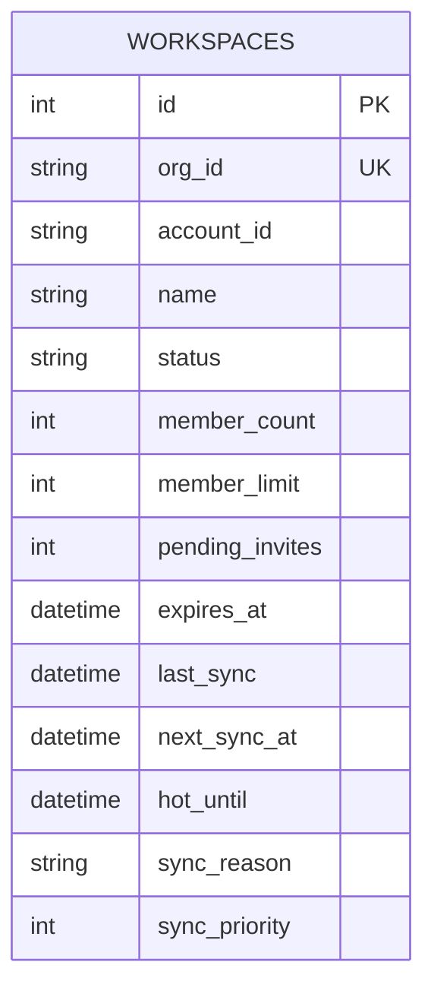
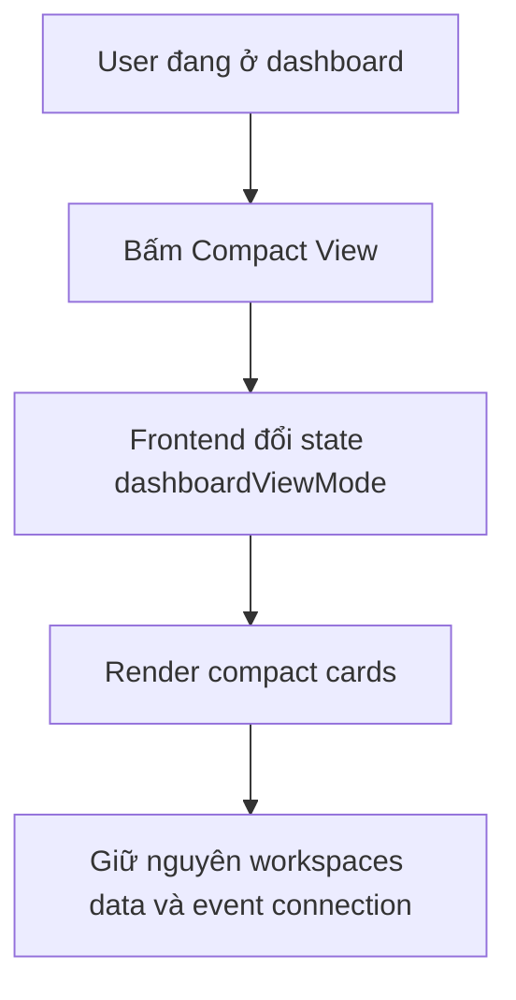
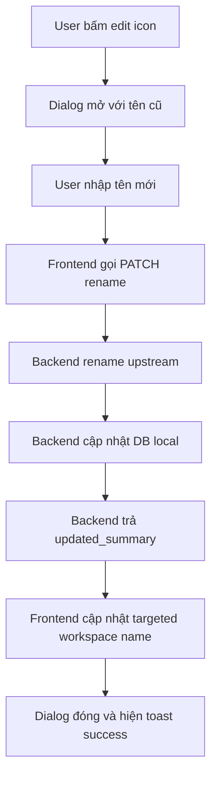
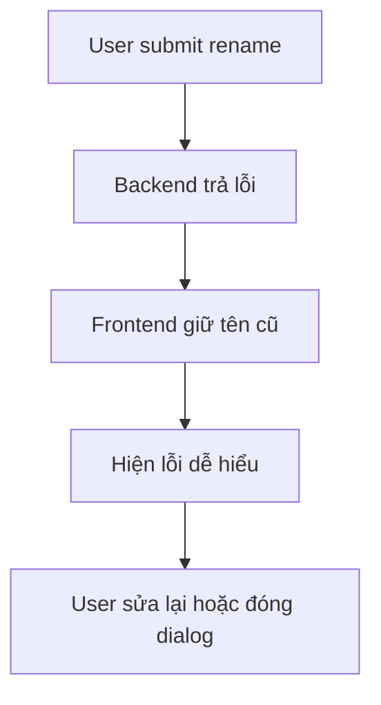
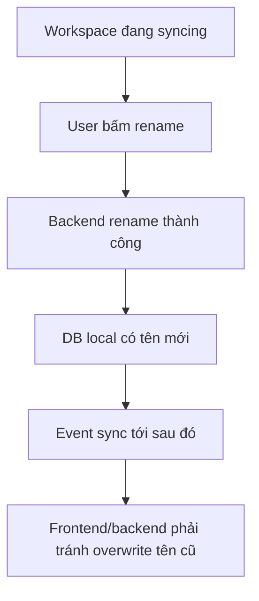

# 🎨 DESIGN: Dashboard Compact View & Real Workspace Rename

Ngày tạo: 2026-03-17 23:09 +07:00  
Dựa trên:
- [plan.md](file:///C:/Users/DungLee/Documents/laptrinh/laptrinh/code/LinhTinh/tool_manage_chatgptTeam/plans/260317-2253-dashboard-view-toggle/plan.md)
- [dashboard_view_toggle_and_rename_spec.md](file:///C:/Users/DungLee/Documents/laptrinh/laptrinh/code/LinhTinh/tool_manage_chatgptTeam/docs/specs/dashboard_view_toggle_and_rename_spec.md)
- Mockup đã duyệt ở bước `/visualize` (style bám ảnh tham chiếu: dark hơn, card gọn hơn, 3 nút cùng 1 hàng)

---

## 1. Mục tiêu của bản thiết kế

Bản thiết kế này trả lời câu hỏi:

> **Làm thế nào để dashboard bớt phải scroll, vẫn dễ quản lý nhiều team, và đổi tên workspace thật mà không sinh bug?**

Trọng tâm của feature này là 3 việc:
- thêm **2 chế độ hiển thị** cho dashboard
- thêm **compact card/list** giống ảnh user chọn
- thêm **rename workspace thật** qua backend/upstream, không đổi tên local giả

Kết quả mong muốn:
- dashboard hiện tại vẫn chạy y như cũ
- compact view giúp thấy nhiều team hơn
- rename thành công thì tên thật đổi luôn
- sync/realtime không phá tên mới

---

## 2. Cách lưu thông tin (Data Design)

### 2.1. Giải thích đơn giản

Feature này **không cần thêm bảng mới trong database**.  
Nó chỉ dùng lại dữ liệu đang có trong bảng `workspaces`.

Hiểu đơn giản:
- Mỗi workspace đã có sẵn một “dòng dữ liệu” trong database
- Dòng đó đã có `org_id`, `name`, `member_count`, `member_limit`, `status`, `expires_at`...
- Feature mới chỉ làm 2 việc:
  1. **hiển thị khác đi** (Current View / Compact View)
  2. **cập nhật trường `name` thật** khi rename thành công

---

### 2.2. Sơ đồ dữ liệu dùng cho feature này



### 2.3. Ý nghĩa các cột quan trọng trong feature này

| Cột | Dùng để làm gì trong UI mới |
|---|---|
| `org_id` | Khóa nhận diện workspace để sync, delete, rename |
| `name` | Tên team hiển thị trên card và là trường được đổi khi rename |
| `member_count` | Số slot đang dùng |
| `member_limit` | Tổng slot, ví dụ `7` |
| `pending_invites` | Hiển thị số invite đang chờ |
| `expires_at` | Hiển thị token expiry / thời gian còn lại |
| `status` | Hiển thị badge live / syncing / error |
| `last_sync`, `next_sync_at`, `sync_reason` | Giúp giải thích trạng thái dashboard và không làm user bị mơ hồ |

---

### 2.4. Rule thiết kế dữ liệu

#### Rule 1 — `name` chỉ đổi khi backend xác nhận thành công
Frontend không được tự đổi tên cho đẹp trước.

#### Rule 2 — Compact View và Current View dùng chung một nguồn dữ liệu
Chỉ khác cách vẽ ra màn hình, không có 2 nguồn state riêng.

#### Rule 3 — Event/SSE không được làm tên mới bị quay về tên cũ
Nếu event đến trễ hơn rename response thì phải có rule tránh overwrite sai.

#### Rule 4 — View mode là state UI, không phải dữ liệu nghiệp vụ
Mode `current` / `compact` sẽ lưu ở localStorage, không lưu DB.

---

### 2.5. Ma trận “nguồn sự thật”

| Dữ liệu | Nguồn sự thật | Khi cập nhật | Frontend nên làm gì |
|---|---|---|---|
| Tên workspace (`name`) | DB local sau khi backend rename thành công | Sau mutation rename | Chỉ update bằng `updated_summary` thật |
| Slot usage | Workspace summary | Sau sync / mutation ảnh hưởng member | Chỉ render lại theo summary mới |
| Pending invites | Workspace summary hoặc detail refresh | Sau invite flow / sync | Không tự tăng giảm từ rename flow |
| Status sync | Sync metadata + SSE | Realtime | Compact/current cùng render chung rule |
| View mode | localStorage | Khi user đổi mode | Không trigger fetch toàn bộ |

---

## 3. Các màn hình / vùng giao diện cần làm

Feature này chủ yếu chạm vào **1 màn hình chính** và **1 hộp thoại nhỏ**.

### 3.1. Dashboard chính

```text
┌────────────────────────────────────────────────────────────────────┐
│  🏠 DASHBOARD                                                     │
│  Mục đích: Quản lý nhiều workspace nhanh hơn                      │
│                                                                    │
│  Header:                                                           │
│  - Tiêu đề                                                         │
│  - Nút Import/Add Team                                             │
│  - View toggle: Current / Compact                                  │
│                                                                    │
│  Nội dung chính:                                                   │
│  - Current View: giữ nguyên card cũ                                │
│  - Compact View: card tối hơn, gọn hơn, ít scroll hơn              │
└────────────────────────────────────────────────────────────────────┘
```

### 3.2. Rename dialog

```text
┌────────────────────────────────────────────────────────────┐
│  ✏️ RENAME WORKSPACE                                       │
│  Mục đích: Đổi tên workspace thật                          │
│                                                            │
│  Input:                                                    │
│  - Tên mới (prefill từ tên hiện tại)                       │
│                                                            │
│  Nút:                                                      │
│  - Cancel                                                  │
│  - Save                                                    │
│                                                            │
│  Kết quả mong muốn:                                        │
│  - Save thành công -> đóng dialog + cập nhật tên mới       │
│  - Save thất bại -> giữ tên cũ + báo lỗi rõ                │
└────────────────────────────────────────────────────────────┘
```

---

## 4. Thiết kế màn hình chi tiết

### 4.1. Header dashboard

Header sẽ có thêm cụm điều khiển mới:

```text
[ Title + subtitle ]                         [ Next sync ] [ + Add Team ] [ Current | Compact ]
```

#### Quy tắc UX
- Toggle đặt ở vùng header để user tìm dễ
- `Compact` active state phải rất rõ
- Chuyển mode phải gần như tức thì
- Không được hiện loading toàn trang chỉ vì đổi mode

---

### 4.2. Current View

Current View giữ nguyên layout hiện tại, chỉ cho phép thêm nhỏ:
- có thể thêm icon edit cạnh tên để đồng nhất hành vi với compact view
- không đổi flow expand, member table, invite panel
- không thay đổi nhịp thao tác cũ của user

**Nguyên tắc:** đây là mode an toàn để không làm vỡ hành vi hiện có.

---

### 4.3. Compact View

Compact View phải bám theo ảnh user duyệt:
- card **tối hơn**
- cấu trúc **gọn hơn**
- hiển thị được nhiều item hơn trên 1 màn hình
- **3 nút chức năng nằm cùng 1 hàng**
- nhìn giống panel quản trị thực chiến hơn là card trưng bày

#### Cấu trúc 1 compact card

```text
┌─────────────────────────────────────┐
│ Team Name ✏️                  🗑️    │
│ [status badge]                      │
│ Members                     3 / 7   │
│ Pending                         0    │
│ Token expires in 9d 17h 26m         │
│ ─────────────────────────────────── │
│ [ Rename ] [ Sync ] [ Manage ]      │
└─────────────────────────────────────┘
```

#### Quy tắc hiển thị
- Tên team là thứ dễ quét nhất
- `3 / 7` phải nổi hơn số phụ khác
- Màu card tối hơn background cũ nhưng vẫn đủ tương phản để dễ đọc
- 3 nút chính phải luôn cùng 1 hàng, spacing đều, không lệch trục
- Nếu có delete icon riêng thì để góc trên hoặc tách nhẹ, không phá hàng 3 nút chính

---

### 4.4. Rename interaction

Luồng người dùng:

```text
User bấm icon edit
→ mở dialog rename
→ tên cũ được điền sẵn
→ user sửa tên
→ bấm Save
→ backend gọi upstream rename
→ thành công: dashboard đổi tên mới
→ thất bại: giữ tên cũ + báo lỗi
```

#### Quy tắc UX
- Trong lúc đang lưu: disable nút Save
- Không cho submit 2 lần liên tiếp
- Nếu nhập tên y hệt tên cũ: chặn ngay ở frontend
- Nếu backend báo lỗi quyền / token / upstream: nói dễ hiểu

---

## 5. Thiết kế trách nhiệm giữa frontend và backend

### 5.1. Backend chịu trách nhiệm gì?

Backend là nơi xác nhận “đổi tên thật hay chưa”.

Backend phải:
- nhận request rename
- kiểm tra workspace có tồn tại không
- kiểm tra input có hợp lệ không
- gọi upstream/internal flow để đổi tên thật
- nếu upstream thành công thì cập nhật `Workspace.name` trong DB local
- trả `updated_summary` về frontend

### 5.2. Frontend chịu trách nhiệm gì?

Frontend là nơi làm trải nghiệm mượt.

Frontend phải:
- mở/đóng rename dialog
- validate input cơ bản
- show loading state
- update title trên card **chỉ khi backend trả success**
- giữ nguyên mode đang xem (`current` hoặc `compact`)

### 5.3. Frontend không nên làm gì?

Frontend không nên:
- tự rename local trước khi backend xác nhận
- tự reload full dashboard mỗi lần đổi mode
- tạo logic action riêng cho compact view khác current view

---

## 6. Thiết kế state frontend

### 6.1. State mới cần có

Ngoài state hiện có trong `page.tsx`, feature này thêm 3 nhóm state mới:

```text
dashboardViewMode
renameDialogState
renameSubmittingState
```

### 6.2. Ý nghĩa từng state

#### `dashboardViewMode`
Lưu user đang chọn:
- `current`
- `compact`

Nguồn lưu:
- state React hiện tại
- localStorage để nhớ lại sau reload

#### `renameDialogState`
Lưu:
- workspace nào đang được rename
- tên cũ là gì
- dialog có đang mở không

#### `renameSubmittingState`
Lưu:
- request rename có đang chạy không
- để disable button và chặn double submit

---

### 6.3. Rule update state

#### Loại A — Presentation-only update
Ví dụ: đổi từ `current` sang `compact`

=> chỉ đổi layout, **không refetch data mặc định**

#### Loại B — Confirmed mutation update
Ví dụ: rename thành công

=> update targeted summary bằng `updated_summary`

#### Loại C — Background-safe refresh
Ví dụ: backend trả `refresh_hint`

=> có thể refresh nhẹ list/detail nếu cần, nhưng không full reload mù

---

## 7. Luồng hoạt động chính

### 7.1. Hành trình 1 — Chuyển qua Compact View



#### Điều user mong đợi
- đổi view ngay lập tức
- không bị chớp loading khó chịu
- dữ liệu vẫn là dữ liệu cũ, chỉ khác cách nhìn

---

### 7.2. Hành trình 2 — Rename workspace thành công



#### Điều user mong đợi
- tên đổi thật
- đổi xong thấy ngay trên card
- không cần F5

---

### 7.3. Hành trình 3 — Rename workspace thất bại



#### Mục tiêu UX
- không tạo cảm giác “đã đổi rồi” khi thực tế chưa đổi
- lỗi phải dễ hiểu, không quá kỹ thuật

---

### 7.4. Hành trình 4 — Rename trong lúc sync đang chạy



#### Điểm dễ lỗi
- event đến trễ và mang theo summary cũ
- sync refresh đè mất tên mới

=> cần rule bảo vệ trong code.

---

## 8. Danh sách component / mảnh ghép giao diện

| Component | Vai trò | Cần làm gì |
|---|---|---|
| `page.tsx` | Điều phối dashboard | thêm toggle mode + nối compact renderer + rename state |
| `workspace-card.tsx` | Card cũ cho Current View | giữ nguyên, chỉ chỉnh nhẹ nếu cần edit entry point |
| `compact-workspace-card.tsx` | Card mới cho Compact View | component mới, dark hơn, gọn hơn, 3 nút cùng hàng |
| `dashboard-view-toggle.tsx` | Nút chuyển view | component mới, hiển thị active state |
| `rename-workspace-dialog.tsx` | Hộp thoại đổi tên | component mới |
| `api.ts` | Gọi backend | thêm hàm rename workspace |
| `workspace-state.ts` | helper update summary | có thể mở rộng để merge rename summary an toàn |

---

## 9. Thiết kế backend cụ thể

### 9.1. Cửa API mới

Đề xuất dùng:

```text
PATCH /api/workspaces/{id}/name
```

### 9.2. Request body

```json
{
  "name": "New Workspace Name"
}
```

### 9.3. Response thành công

```json
{
  "ok": true,
  "message": "Workspace renamed successfully",
  "updated_summary": {
    "org_id": "org_001",
    "name": "New Workspace Name"
  },
  "refresh_hint": {
    "scope": "workspace_list",
    "reason": "workspace_renamed",
    "org_id": "org_001",
    "include_details": false
  }
}
```

### 9.4. Các lỗi cần chuẩn hóa

- `400` — tên không hợp lệ
- `401/403` — token hoặc quyền không đủ
- `404` — workspace không tồn tại
- `409` — trạng thái hiện tại không cho rename
- `502` — upstream rename thất bại

---

## 10. Quy tắc kiểm tra (Acceptance Criteria)

### 10.1. Tính năng: View Toggle

#### Cơ bản
- [ ] Có 2 mode `Current View` và `Compact View`
- [ ] Bấm toggle đổi mode được ngay
- [ ] Reload trang vẫn nhớ mode trước đó

#### Trải nghiệm
- [ ] Đổi mode không gây loading toàn trang
- [ ] Không làm gãy action sync/delete/import hiện có
- [ ] Compact view bớt scroll rõ rệt khi có nhiều team

---

### 10.2. Tính năng: Compact View

#### Cơ bản
- [ ] Hiển thị tên team
- [ ] Hiển thị slot usage kiểu `x / 7`
- [ ] Hiển thị pending
- [ ] Hiển thị expiry
- [ ] Có icon edit
- [ ] Có 3 nút chức năng cùng 1 hàng

#### Trải nghiệm
- [ ] Card tối hơn, sát style mockup đã duyệt
- [ ] Dễ quét mắt nhanh
- [ ] Không bị rối khi nhiều workspace xuất hiện cùng lúc

---

### 10.3. Tính năng: Rename Workspace

#### Cơ bản
- [ ] Bấm icon edit mở được dialog rename
- [ ] Input có sẵn tên cũ
- [ ] Save thành công thì tên mới xuất hiện ngay trên dashboard
- [ ] Save thất bại thì tên cũ vẫn giữ nguyên

#### Nâng cao
- [ ] Không cho submit tên rỗng
- [ ] Không cho submit tên y hệt tên cũ
- [ ] Không double submit khi request đang chạy
- [ ] Rename thật qua backend/upstream, không phải đổi local giả

#### Trải nghiệm
- [ ] Error message dễ hiểu
- [ ] Không cần F5 để thấy tên mới
- [ ] Không bị event/sync ghi đè tên mới sai cách

---

## 11. Test Cases Outline

### TC-01: Toggle sang compact mode
**Given:** User đang ở dashboard current view  
**When:** Bấm `Compact View`  
**Then:**
- ✓ Giao diện chuyển sang compact
- ✓ Không refetch toàn bộ mặc định
- ✓ Danh sách workspace vẫn giữ nguyên dữ liệu

### TC-02: Persist compact mode
**Given:** User đã chọn compact view  
**When:** Reload trang  
**Then:**
- ✓ Dashboard mở lại ở compact view

### TC-03: Rename happy path
**Given:** Workspace tồn tại, user có quyền rename  
**When:** Mở dialog, nhập tên mới hợp lệ, bấm Save  
**Then:**
- ✓ Backend gọi rename upstream thành công
- ✓ DB local cập nhật `name`
- ✓ UI đổi tên ngay bằng `updated_summary`

### TC-04: Rename invalid input
**Given:** Dialog rename đang mở  
**When:** User nhập chuỗi rỗng hoặc toàn space  
**Then:**
- ✓ Frontend chặn submit
- ✓ Hiện thông báo rõ ràng

### TC-05: Rename upstream fail
**Given:** User submit tên mới hợp lệ  
**When:** Upstream rename thất bại  
**Then:**
- ✓ UI giữ tên cũ
- ✓ Hiện lỗi rõ
- ✓ Không để local state bị lệch

### TC-06: Rename while sync event arrives
**Given:** Rename vừa thành công  
**When:** SSE/sync event tới trễ  
**Then:**
- ✓ Tên mới không bị quay lại tên cũ
- ✓ Dashboard vẫn ổn định

### TC-07: Compact view action alignment
**Given:** Có nhiều workspace card trong compact view  
**When:** Dashboard render  
**Then:**
- ✓ 3 nút chức năng trong mỗi card luôn nằm cùng 1 hàng
- ✓ Không lệch hàng khi tên team dài hơn bình thường

---

## 12. Đề xuất cấu trúc code sau khi làm feature

```text
frontend/src/
├─ app/
│  └─ page.tsx
├─ components/
│  ├─ workspace-card.tsx
│  ├─ compact-workspace-card.tsx      (mới)
│  ├─ dashboard-view-toggle.tsx       (mới)
│  ├─ rename-workspace-dialog.tsx     (mới)
│  ├─ member-table.tsx
│  ├─ invite-list.tsx
│  └─ import-dialog.tsx
└─ lib/
   ├─ api.ts
   └─ workspace-state.ts
```

```text
backend/app/
├─ routers/
│  └─ workspaces.py          (+ route rename)
├─ services/
│  ├─ chatgpt.py             (+ upstream rename function hoặc helper)
│  ├─ workspace_sync.py      (review guard overwrite nếu cần)
│  └─ workspace_service.py   (tùy chọn nếu muốn tách use-case rename)
└─ models.py
```

---

## 13. Quyết định thiết kế quan trọng

### Quyết định 1
**Current View là baseline an toàn.**  
Lý do: không phá flow cũ trong lúc thêm feature mới.

### Quyết định 2
**Compact View chỉ là presentation mode, không phải data mode.**  
Lý do: tránh có 2 logic dữ liệu khác nhau.

### Quyết định 3
**Rename chỉ commit lên UI sau khi backend xác nhận.**  
Lý do: tránh UI trông đúng nhưng tên thật chưa đổi.

### Quyết định 4
**3 nút chức năng trong compact card phải là một layout contract.**  
Lý do: đây là điểm user đã yêu cầu rõ; không được để CSS linh hoạt quá mức làm lệch hàng.

### Quyết định 5
**Design style sẽ bám mockup user đã duyệt.**  
Lý do: giảm tranh cãi ở phase code; dark hơn, card gọn hơn, ít màu mè hơn.

---

## 14. Kết luận

Thiết kế cho feature này là:
- giữ nguyên dashboard hiện tại làm mode 1
- thêm compact mode cho case nhiều team
- thêm rename workspace thật qua backend/upstream
- bảo vệ state để sync/event không ghi đè sai
- viết acceptance criteria và test cases trước khi code

Nếu bám đúng bản thiết kế này, feature mới sẽ đạt mục tiêu:

> **ít scroll hơn, thao tác nhanh hơn, tên team chính xác hơn, và vẫn ổn định khi chạy thực tế**

---

*Tạo bởi AWF - Design Phase*
