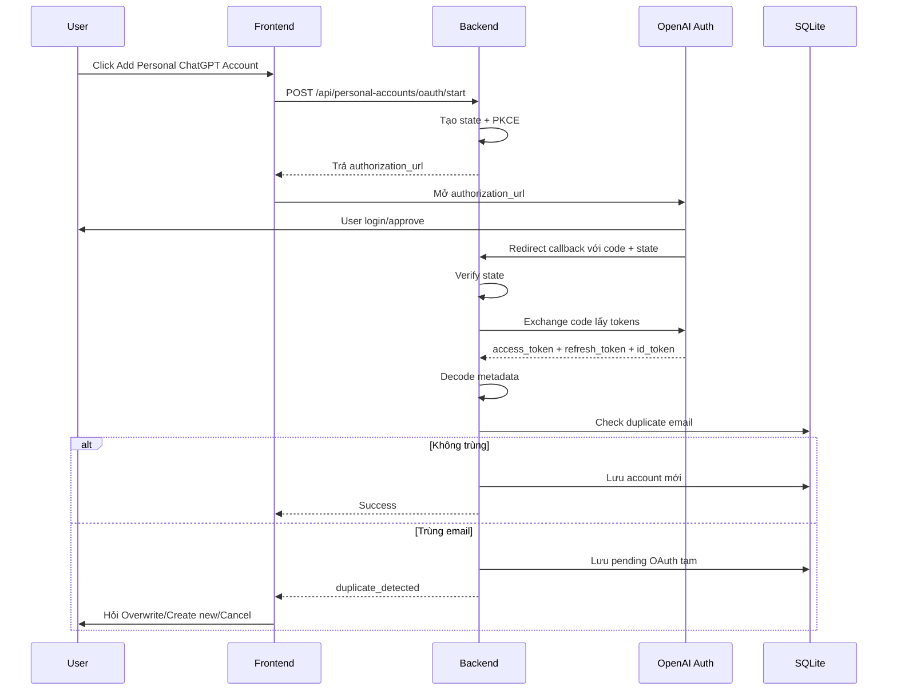

# 🎨 DESIGN: Personal ChatGPT Accounts OAuth

Ngày tạo: 2026-05-19 02:30 +07:00  
Dựa trên:

- [Plan](file:///C:/Users/DungLee/Documents/laptrinh/laptrinh/code/LinhTinh/tool_manage_chatgptTeam/plans/260519-0226-personal-chatgpt-accounts/plan.md)
- [Spec](file:///C:/Users/DungLee/Documents/laptrinh/laptrinh/code/LinhTinh/tool_manage_chatgptTeam/docs/specs/personal_chatgpt_accounts_spec.md)

---

## 1. Mục tiêu thiết kế

Thêm khu vực **Personal Accounts** vào tool hiện tại để quản lý tài khoản ChatGPT cá nhân.

Mục tiêu chính:

- Add account bằng OAuth.
- Theo dõi acc `Live`, `Die`, `Need re-login`.
- Lưu token nội bộ, không hiển thị token trên UI.
- Refresh token an toàn theo kiểu 9router.
- Không ảnh hưởng tab Team Workspaces hiện tại.

---

## 2. Cách lưu thông tin

Giống như thêm một sheet Excel mới tên `personal_accounts`, tách riêng hoàn toàn khỏi sheet `workspaces` hiện tại.

```text
┌──────────────────────────────────────────────────────────────┐
│ 👤 PERSONAL_ACCOUNTS                                         │
│ Dùng để lưu acc ChatGPT cá nhân                              │
├──────────────────────────────────────────────────────────────┤
│ id                         mã nội bộ                         │
│ provider                   codex/chatgpt                     │
│ provider_account_id        id account từ OAuth nếu có         │
│ email                      email acc                         │
│ name                       tên acc                           │
│ plan_type                  free/plus/pro/unknown              │
│ status                     live/die/need_relogin/unknown      │
│ auth_type                  oauth                              │
│ access_token               token truy cập, KHÔNG show UI      │
│ refresh_token              token refresh, KHÔNG show UI       │
│ id_token                   token định danh, KHÔNG show UI     │
│ token_expires_at           access token hết hạn lúc nào       │
│ refresh_token_updated_at   refresh token đổi lần cuối         │
│ last_checked_at            check live/die lần cuối            │
│ last_refreshed_at          refresh thành công lần cuối        │
│ next_refresh_at            dự kiến refresh tiếp theo          │
│ last_error_code            mã lỗi gần nhất                    │
│ last_error_message         lỗi thân thiện để hiện UI           │
│ reauth_required_at         lúc bị yêu cầu login lại            │
│ provider_specific_data     JSON metadata phụ                  │
│ is_active                  còn dùng không                     │
│ created_at                 ngày tạo                           │
│ updated_at                 ngày cập nhật                      │
└──────────────────────────────────────────────────────────────┘
```

### Model đề xuất

```python
class PersonalAccount(Base):
    __tablename__ = "personal_accounts"
    __table_args__ = (
        Index("ix_personal_accounts_provider_email", "provider", "email"),
        Index("ix_personal_accounts_provider_account_id", "provider", "provider_account_id"),
        Index("ix_personal_accounts_status", "status"),
    )

    id: Mapped[int] = mapped_column(Integer, primary_key=True)
    provider: Mapped[str] = mapped_column(String, default="codex", index=True)
    provider_account_id: Mapped[str | None] = mapped_column(String, nullable=True)
    email: Mapped[str] = mapped_column(String, index=True)
    name: Mapped[str] = mapped_column(String, default="")
    plan_type: Mapped[str] = mapped_column(String, default="unknown")
    status: Mapped[str] = mapped_column(String, default="unknown")
    auth_type: Mapped[str] = mapped_column(String, default="oauth")
    access_token: Mapped[str | None] = mapped_column(Text, nullable=True)
    refresh_token: Mapped[str | None] = mapped_column(Text, nullable=True)
    id_token: Mapped[str | None] = mapped_column(Text, nullable=True)
    token_expires_at: Mapped[datetime | None] = mapped_column(DateTime, nullable=True)
    refresh_token_updated_at: Mapped[datetime | None] = mapped_column(DateTime, nullable=True)
    last_checked_at: Mapped[datetime | None] = mapped_column(DateTime, nullable=True)
    last_refreshed_at: Mapped[datetime | None] = mapped_column(DateTime, nullable=True)
    next_refresh_at: Mapped[datetime | None] = mapped_column(DateTime, nullable=True)
    last_error_code: Mapped[str | None] = mapped_column(String, nullable=True)
    last_error_message: Mapped[str | None] = mapped_column(Text, nullable=True)
    reauth_required_at: Mapped[datetime | None] = mapped_column(DateTime, nullable=True)
    provider_specific_data: Mapped[str | None] = mapped_column(Text, nullable=True)
    is_active: Mapped[bool] = mapped_column(default=True)
    created_at: Mapped[datetime] = mapped_column(DateTime, default=lambda: datetime.now(timezone.utc))
    updated_at: Mapped[datetime] = mapped_column(DateTime, default=lambda: datetime.now(timezone.utc))
```

### Migration

Project hiện dùng `Base.metadata.create_all()` và migration thủ công trong `backend/app/db.py`.

Thiết kế migration:

- Thêm model trong `backend/app/models.py`.
- `create_all()` tự tạo table mới.
- Bổ sung helper `_create_personal_accounts_table_if_missing()` hoặc để `create_all()` xử lý.
- Bổ sung add-column migration về sau nếu cần mở rộng.

---

## 3. Backend module design

Thêm router/service riêng. Không trộn vào `workspaces.py`.

```text
backend/app/
├── routers/
│   └── personal_accounts.py
├── services/
│   └── personal_accounts/
│       ├── __init__.py
│       ├── oauth.py
│       ├── refresh.py
│       ├── health.py
│       ├── repository.py
│       ├── serializers.py
│       ├── tokens.py
│       └── redaction.py
├── models.py
├── schemas.py
└── main.py
```

### Trách nhiệm từng file

| File                           | Nhiệm vụ                                    |
| ------------------------------ | ------------------------------------------- |
| `routers/personal_accounts.py` | Các cửa API cho frontend gọi                |
| `oauth.py`                     | Tạo OAuth URL, callback, đổi code lấy token |
| `refresh.py`                   | Refresh token an toàn, chống gọi song song  |
| `health.py`                    | Check trạng thái Live/Die/Need re-login     |
| `repository.py`                | Đọc/ghi DB                                  |
| `serializers.py`               | Trả dữ liệu public, loại token              |
| `tokens.py`                    | Decode JWT, tính expiry                     |
| `redaction.py`                 | Xóa/mask token trong log/error              |

---

## 4. OAuth flow design

### Luồng thêm account



### OAuth config

```env
ENABLE_EXPERIMENTAL_CHATGPT_OAUTH=true
CHATGPT_OAUTH_CLIENT_ID=app_EMoamEEZ73f0CkXaXp7hrann
CHATGPT_OAUTH_AUTH_URL=https://auth.openai.com/oauth/authorize
CHATGPT_OAUTH_TOKEN_URL=https://auth.openai.com/oauth/token
CHATGPT_OAUTH_REDIRECT_URI=http://localhost:8000/api/personal-accounts/oauth/callback
```

### Scope

```text
openid profile email offline_access
```

### Pending OAuth storage

MVP có thể dùng in-memory store vì app chạy local:

```python
pending_oauth_sessions: dict[str, PendingOAuthSession]
pending_duplicate_tokens: dict[str, PendingAccountPayload]
```

Mỗi pending item nên có:

```text
id
state
code_verifier
created_at
expires_at
provider
```

TTL đề xuất: `10 phút`.

> Ghi chú: Nếu sau này chạy VPS/multi-process, chuyển pending store vào DB.

---

## 5. Refresh token design

OpenAI/Codex refresh token là kiểu xoay vòng: dùng refresh token cũ xong phải lưu refresh token mới ngay.

### Quy tắc bắt buộc

```text
1. Mỗi account chỉ được refresh 1 lần tại cùng thời điểm.
2. Nếu có request refresh thứ 2, nó phải chờ request đầu.
3. Nếu response có refresh_token mới, lưu ngay vào DB.
4. Không retry mù với lỗi unrecoverable.
5. Nếu unrecoverable, mark Need re-login.
```

### In-flight lock

```python
_refresh_locks: dict[int, asyncio.Lock] = {}
```

Hoặc nếu code sync:

```python
_refresh_locks: dict[int, threading.Lock] = {}
```

### Unrecoverable errors

```text
refresh_token_reused
invalid_grant
token_expired
invalid_token
invalid_request
```

### Refresh endpoint upstream

```text
POST https://auth.openai.com/oauth/token
Content-Type: application/x-www-form-urlencoded

 grant_type=refresh_token
 refresh_token=<current_refresh_token>
 client_id=app_EMoamEEZ73f0CkXaXp7hrann
 scope=openid profile email offline_access
```

### Refresh result

Success:

```text
status = live
access_token = new access token
refresh_token = new refresh token if provided
last_refreshed_at = now
next_refresh_at = token_expires_at - refresh lead
last_error_code = null
last_error_message = null
```

Failure unrecoverable:

```text
status = need_relogin
reauth_required_at = now
last_error_code = error code
last_error_message = friendly message
```

---

## 6. API design

### Public account response

Không bao giờ trả token.

```json
{
  "id": 1,
  "provider": "codex",
  "auth_type": "oauth",
  "email": "user@example.com",
  "name": "User Name",
  "plan_type": "plus",
  "status": "live",
  "is_active": true,
  "token_expires_at": "2026-05-19T10:00:00Z",
  "last_checked_at": "2026-05-19T02:00:00Z",
  "last_refreshed_at": "2026-05-19T02:00:00Z",
  "next_refresh_at": "2026-05-20T02:00:00Z",
  "last_error_code": null,
  "last_error_message": null,
  "oauth_connected": true,
  "requires_relogin": false,
  "created_at": "2026-05-19T02:00:00Z",
  "updated_at": "2026-05-19T02:00:00Z"
}
```

### Endpoints

| Method | Path                                             | Mục đích                |
| ------ | ------------------------------------------------ | ----------------------- |
| GET    | `/api/personal-accounts`                         | Lấy danh sách acc       |
| GET    | `/api/personal-accounts/{id}`                    | Lấy chi tiết public     |
| DELETE | `/api/personal-accounts/{id}`                    | Xóa acc                 |
| POST   | `/api/personal-accounts/{id}/refresh`            | Refresh token thủ công  |
| POST   | `/api/personal-accounts/{id}/check`              | Check live/die thủ công |
| POST   | `/api/personal-accounts/{id}/reconnect/start`    | OAuth lại acc lỗi       |
| POST   | `/api/personal-accounts/oauth/start`             | Bắt đầu thêm acc        |
| GET    | `/api/personal-accounts/oauth/callback`          | OAuth callback local    |
| POST   | `/api/personal-accounts/oauth/resolve-duplicate` | Xử lý trùng email       |

### Action result shape

```json
{
  "ok": true,
  "message": "Account refreshed",
  "account": {},
  "next_action": null
}
```

Duplicate result:

```json
{
  "ok": false,
  "code": "duplicate_detected",
  "message": "Account already exists",
  "duplicate": {},
  "pending_oauth_id": "...",
  "options": ["overwrite_existing", "create_new", "cancel"]
}
```

---

## 7. Frontend design

### Màn hình chính

Thêm tab vào dashboard hiện tại:

```text
┌──────────────────────────────────────────────────────────────┐
│ Team Workspaces | Personal Accounts                         │
└──────────────────────────────────────────────────────────────┘
```

### Personal Accounts panel

```text
┌──────────────────────────────────────────────────────────────┐
│ Personal ChatGPT Accounts           [+ Add Personal ChatGPT] │
├──────────────────────────────────────────────────────────────┤
│ Total Accounts | Live | Need Re-login | Last Auto Refresh    │
├──────────────────────────────────────────────────────────────┤
│ Account Card | Account Card | Account Card                   │
└──────────────────────────────────────────────────────────────┘
```

### Account card

```text
┌─────────────────────────────────────────────┐
│ Avatar  Name                         LIVE   │
│         email@example.com                    │
│                                             │
│ Plan: Plus                                  │
│ OAuth: Connected                            │
│ Last checked: 2 minutes ago                 │
│ Last refreshed: 1 hour ago                  │
│ Next refresh: tomorrow                      │
│                                             │
│ [Check Now] [Refresh] [Reconnect] [Delete]  │
└─────────────────────────────────────────────┘
```

### Duplicate modal

```text
┌─────────────────────────────────────────────┐
│ Account already exists                      │
│                                             │
│ Email user@example.com already exists.      │
│ What do you want to do?                     │
│                                             │
│ [Overwrite existing] [Create new] [Cancel]  │
└─────────────────────────────────────────────┘
```

### Frontend files

```text
frontend/src/components/personal-accounts-panel.tsx
frontend/src/components/personal-account-card.tsx
frontend/src/components/personal-account-duplicate-modal.tsx
frontend/src/types/personal-accounts.ts
```

Nếu project đang dùng PascalCase file style, dùng:

```text
PersonalAccountsPanel.tsx
PersonalAccountCard.tsx
PersonalAccountDuplicateModal.tsx
```

---

## 8. User journeys

### Journey 1: Add account thành công

```text
1. User mở app.
2. Chọn tab Personal Accounts.
3. Bấm Add Personal ChatGPT Account.
4. Browser mở OAuth login.
5. User login thành công.
6. Backend nhận callback.
7. Account card xuất hiện với status Live/Unknown.
```

### Journey 2: Duplicate email

```text
1. User add account bằng email đã tồn tại.
2. Backend phát hiện trùng provider + email.
3. UI hiện modal.
4. User chọn:
   - Overwrite existing
   - Create new account
   - Cancel
5. UI cập nhật theo lựa chọn.
```

### Journey 3: Refresh lỗi

```text
1. User bấm Refresh hoặc hệ thống refresh.
2. Upstream trả invalid_grant/refresh_token_reused.
3. Backend không retry mù.
4. Account được mark Need re-login.
5. UI hiện nút Reconnect.
```

---

## 9. Acceptance criteria

### Add account

- [ ] Bấm `Add Personal ChatGPT Account` mở OAuth URL.
- [ ] Callback hợp lệ lưu account.
- [ ] Callback sai state bị từ chối.
- [ ] OAuth lỗi hiển thị message dễ hiểu.
- [ ] Không có fallback paste token.

### Token safety

- [ ] API list/detail không trả `access_token`.
- [ ] API list/detail không trả `refresh_token`.
- [ ] API list/detail không trả `id_token`.
- [ ] UI không render token.
- [ ] Logs không chứa token.

### Duplicate

- [ ] Trùng provider + email hiện modal.
- [ ] Overwrite cập nhật account cũ.
- [ ] Create new tạo record mới.
- [ ] Cancel không thay đổi DB.

### Refresh

- [ ] Refresh thành công cập nhật token mới.
- [ ] Refresh token mới được lưu ngay.
- [ ] Refresh song song cùng account chỉ gọi upstream một lần.
- [ ] Unrecoverable error mark `Need re-login`.
- [ ] Reconnect có thể bắt đầu OAuth lại.

### Regression

- [ ] Team Workspaces tab vẫn load bình thường.
- [ ] Existing workspace APIs không đổi contract.
- [ ] Existing quality checks pass.

---

## 10. Test cases

### TC-01: OAuth add happy path

Given: backend chạy local và OAuth enabled  
When: user bấm add account và login thành công  
Then:

- account được lưu
- card xuất hiện
- token không xuất hiện trong response/UI

### TC-02: OAuth callback state invalid

Given: pending OAuth state không tồn tại  
When: callback nhận state sai  
Then:

- request bị từ chối
- không lưu account
- trả message lỗi dễ hiểu

### TC-03: Duplicate email

Given: DB đã có account `user@example.com`  
When: OAuth callback trả về cùng email  
Then:

- backend trả `duplicate_detected`
- UI hiện modal
- không overwrite tự động

### TC-04: Refresh success with rotated token

Given: account có refresh token hợp lệ  
When: gọi refresh  
Then:

- access token mới được lưu
- refresh token mới được lưu nếu response có
- status là `live`
- `last_refreshed_at` được cập nhật

### TC-05: Refresh invalid_grant

Given: account có refresh token invalid  
When: gọi refresh  
Then:

- status là `need_relogin`
- không retry mù
- giữ account card
- UI hiện Reconnect

### TC-06: Token redaction

Given: account có tokens trong DB  
When: gọi list/detail API  
Then:

- response không có `access_token`
- response không có `refresh_token`
- response không có `id_token`

### TC-07: Team tab smoke test

Given: feature Personal Accounts đã thêm  
When: mở Team Workspaces tab  
Then:

- danh sách workspace vẫn render
- sync/member/invite actions không bị đổi behavior

---

## 11. Security guardrails

- Không log raw OAuth token response.
- Không truyền token sang frontend.
- Không thêm token vào toast/error message.
- Không dùng `repr(account.__dict__)` khi account có token.
- Redact các key:
  - `access_token`
  - `refresh_token`
  - `id_token`
  - `authorization`
  - `bearer`

---

## 12. Handoff cho `/code`

Nên code theo thứ tự:

1. Phase 01: rà soát boundary.
2. Phase 02: thêm model + migration.
3. Phase 03: OAuth backend.
4. Phase 04: refresh service.
5. Phase 05: API contracts.
6. Phase 06: frontend tab.
7. Phase 07: tests + hardening.

File chính cần đụng:

```text
backend/app/models.py
backend/app/db.py
backend/app/main.py
backend/app/schemas.py
backend/app/routers/personal_accounts.py
backend/app/services/personal_accounts/*.py
frontend/src/app/page.tsx
frontend/src/components/*personal-account*.tsx
```

---

_Tạo bởi AWF Design Phase._
