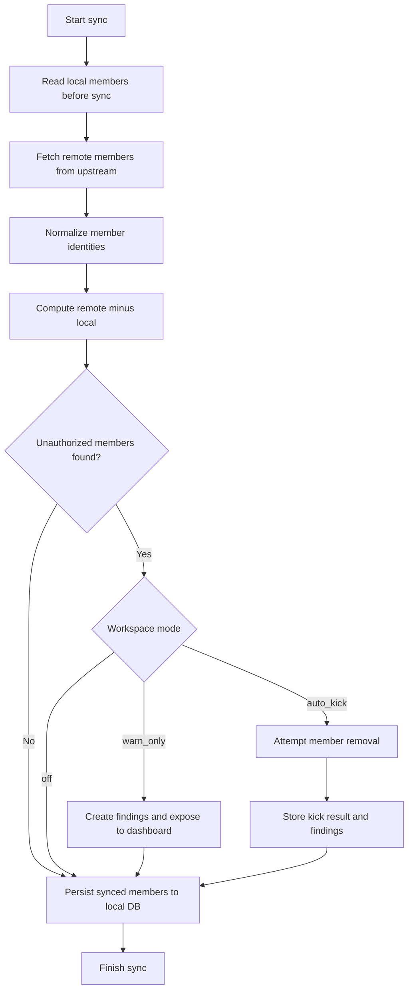

# Spec: Auto Kick Unauthorized Member

**Created:** 2026-04-03 04:56 +07:00  
**Feature owner:** DungLee  
**Status:** Draft

---

## 1. Executive Summary

Feature này thêm cơ chế phát hiện và xử lý **unauthorized member** cho từng workspace.

Nguyên tắc cốt lõi đã chốt:

- **Local database trước sync** là danh sách whitelist mặc định.
- Anh **chỉ dùng tool để add member hợp lệ**.
- Nếu có member nào xuất hiện trên upstream nhưng local DB trước sync chưa từng có, thì member đó bị coi là **unauthorized**.

Feature không xử lý pending invite lạ và không cố tìm thông tin “ai là người mời” từ upstream.

---

## 2. User Stories

### Primary

- Là người quản lý workspace, tôi muốn phát hiện member lạ xuất hiện ngoài local DB để biết team có bị add ngoài luồng hay không.
- Là người quản lý workspace, tôi muốn bật chế độ tự kick member lạ để không cần kiểm tra tay từng lần.
- Là người quản lý workspace, tôi muốn dashboard hiển thị rõ workspace nào đang có unauthorized member.

### Secondary

- Là người vận hành tool, tôi muốn có chế độ `warn_only` trước khi bật `auto_kick` để kiểm tra logic an toàn.
- Là người debug hệ thống, tôi muốn xem lý do detect/kick để truy vết false positive nếu có.

---

## 3. Scope & Non-Goals

### In Scope

- Detect unauthorized member qua diff local-before-sync vs remote-after-fetch.
- Policy mode per workspace: `off`, `warn_only`, `auto_kick`.
- Dashboard hiển thị unauthorized findings.
- Kick unauthorized member tự động hoặc thủ công.
- Logging và test coverage cho flow này.

### Non-Goals

- Không xử lý pending invites.
- Không xác định inviter từ upstream.
- Không hỗ trợ member hợp lệ được add ngoài tool.
- Không làm rule engine phức tạp ở phiên bản đầu.

---

## 4. Product Logic

## Whitelist Rule

Một member được coi là authorized nếu:

- có mặt trong local DB trước lần sync hiện tại,
- hoặc là member hợp lệ do tool vừa tạo và đã được flow nội bộ ghi nhận.

## Unauthorized Rule

Một member bị coi là unauthorized nếu:

- tồn tại trong remote member list,
- không có trong local DB snapshot trước sync,
- không nằm trong ngoại lệ hợp lệ của tool.

## Detection Formula

```text
unauthorized_members = remote_members - local_members_before_sync - allowed_tool_exceptions
```

Trong phiên bản đầu, nếu flow add member qua tool đã ghi local đủ chắc, thì có thể xem `allowed_tool_exceptions` là rất nhỏ hoặc bằng 0 ở đa số case.

---

## 5. Data Model (định hướng cho /design)

### A. Workspace Policy

Có thể thêm bảng hoặc field theo workspace:

- `org_id`
- `unauthorized_member_mode` (`off`, `warn_only`, `auto_kick`)
- `unauthorized_member_enabled_at`
- `unauthorized_member_updated_at`

### B. Unauthorized Findings

Nếu persist findings:

- `id`
- `org_id`
- `email`
- `member_remote_id` (nullable)
- `member_name` (nullable)
- `role`
- `detected_at`
- `detection_reason` (`not_in_local_before_sync`)
- `status` (`detected`, `kicked`, `kick_failed`, `trusted`, `ignored`)
- `actioned_at` (nullable)
- `action_error` (nullable)

### C. Optional Audit Log

Nếu muốn theo dõi lịch sử kỹ hơn:

- `org_id`
- `event_type` (`unauthorized_detected`, `unauthorized_kicked`, `unauthorized_kick_failed`)
- `email`
- `payload_json`
- `created_at`

---

## 6. Logic Flowchart



---

## 7. Backend Responsibilities

### Sync Layer

- Snapshot local members before sync.
- Fetch remote members.
- Normalize identities.
- Calculate unauthorized diff before local persist.
- Pass findings to enforcement layer.

### Enforcement Layer

- Read workspace mode.
- If `off`: no action.
- If `warn_only`: save/report findings only.
- If `auto_kick`: kick and record result.

### Router/API Layer

- Expose workspace policy mode.
- Expose unauthorized findings for workspace detail.
- Expose manual actions if needed:
  - `kick now`
  - `trust member`
  - `change mode`

---

## 8. API Contract Ideas (để /design chốt)

### Workspace Detail Response thêm:

- `unauthorized_member_mode`
- `unauthorized_members_count`
- `unauthorized_members[]`

### Policy Update Endpoint

- `PATCH /api/workspaces/{org_id}/unauthorized-policy`
- Request:
  - `mode`
- Response:
  - `ok`
  - `message`
  - `updated_policy`

### Manual Kick Endpoint

- `POST /api/workspaces/{org_id}/unauthorized-members/{finding_id}/kick`

### Trust Endpoint (optional)

- `POST /api/workspaces/{org_id}/unauthorized-members/{finding_id}/trust`

---

## 9. Frontend UI Components

### Workspace Card / Summary

- Badge nếu workspace có unauthorized members.
- Có thể hiện count ngắn gọn.

### Workspace Detail Panel

- Section `Unauthorized members`.
- Hiển thị:
  - email
  - role
  - detected time
  - status
  - action buttons

### Policy Control

- Select / segmented control:
  - Off
  - Warn only
  - Auto kick

---

## 10. Important Edge Cases

- Member email khác casing (`A@x.com` vs `a@x.com`) → phải normalize.
- Remote member đã bị remove tay trước khi auto-kick chạy → coi là `already_removed` hoặc close finding mềm.
- Sync fail giữa chừng sau khi detect → finding không được mất dấu.
- Auto-kick fail vì token/quyền/upstream lỗi → finding chuyển `kick_failed`.
- Tool restart rồi sync lại → logic detection phải vẫn xác định rõ dựa trên local DB còn lại.

---

## 11. Rollout Strategy

### Stage 1

- Implement detection + UI visibility.
- Default mode = `off`.

### Stage 2

- Bật `warn_only` trên workspace test.
- Theo dõi false positive.

### Stage 3

- Bật `auto_kick` cho workspace đã verify logic ổn.

---

## 12. Testing Strategy

### Backend

- Detection helper tests.
- Sync integration tests.
- Enforcement tests.
- Restart scenario tests.

### Frontend

- Unauthorized badge rendering.
- Policy mode toggle.
- Manual kick action state.
- Error display.

### Manual QA

- Tool tắt → member lạ được add → bật tool → sync → detect đúng.
- Member cũ trong local DB không bị false positive.
- Auto-kick bật → member lạ bị remove.
- Auto-kick fail → dashboard báo đúng lỗi.

---

## 13. Build Checklist

- [ ] Chốt data model
- [ ] Chốt sync-before-write flow
- [ ] Implement policy storage
- [ ] Implement findings storage/exposure
- [ ] Implement warn_only behavior
- [ ] Implement auto_kick behavior
- [ ] Implement dashboard panel + mode control
- [ ] Add backend regression tests
- [ ] Add frontend interaction tests
- [ ] Run manual QA trên workspace test

---

## 14. Recommended Next Step

→ Chạy `/design` để chốt chi tiết:

- bảng dữ liệu cần thêm,
- endpoint cụ thể,
- response shape,
- vị trí UI hiển thị unauthorized members,
- thứ tự xử lý trong sync pipeline.
