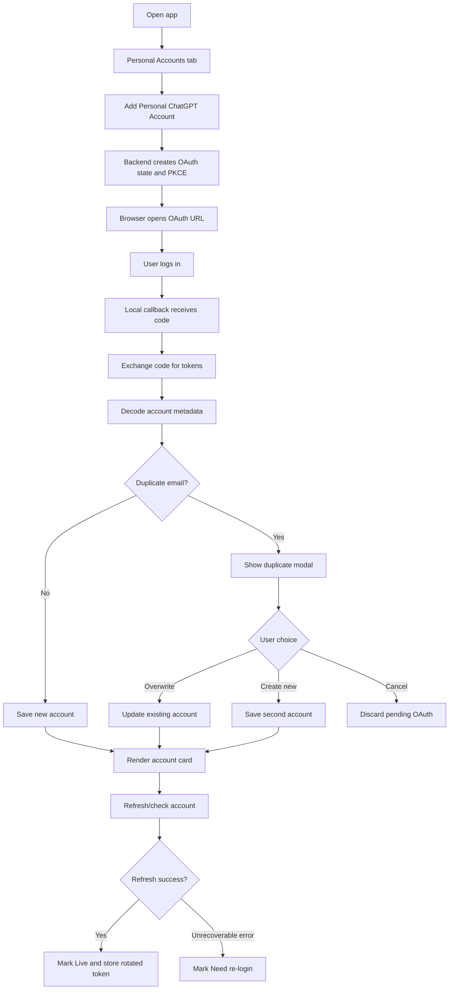

# Spec: Personal ChatGPT Accounts OAuth

Created: 2026-05-19 02:26 +07:00
Status: Implemented through Phase 07 hardening

## 1. Executive Summary

Add a new **Personal Accounts** tab to the existing ChatGPT Team Manager.

The feature lets the user add personal ChatGPT accounts using OAuth, stores token data internally, refreshes tokens safely, and shows whether each account is **Live**, **Die**, or **Need re-login**.

The existing **Team Workspaces** tab must remain unchanged.

## 2. User Stories

- As the tool owner, I want to add a personal ChatGPT account through OAuth so I do not paste tokens manually.
- As the tool owner, I want to see whether each account is live or needs attention.
- As the tool owner, I do not want tokens shown in the UI after adding an account.
- As the tool owner, I want the tool to refresh tokens automatically/safely so account monitoring keeps working.
- As the tool owner, when I add the same email again, I want to choose overwrite, create new, or cancel.
- As the tool owner, if refresh fails permanently, I want the account marked `Need re-login` and have a `Reconnect` button.

## 3. Scope

### MVP

- Personal Accounts tab.
- OAuth-only add flow.
- Local callback flow.
- Account cards with health status.
- Manual refresh/check/reconnect/delete.
- Duplicate account modal.
- Safe refresh-token rotation handling.
- Token redaction from UI/API/logs.

### Phase 2

- Background scheduled auto refresh.
- Filter/search.
- Check/refresh history.
- Health alerts.

## 4. Data Model Draft

Table: `personal_accounts`

```text
id
provider
provider_account_id
email
name
plan_type
status
auth_type
access_token
refresh_token
id_token
token_expires_at
refresh_token_updated_at
last_checked_at
last_refreshed_at
next_refresh_at
last_error_code
last_error_message
reauth_required_at
provider_specific_data
is_active
created_at
updated_at
```

Status values:

```text
unknown
live
die
need_relogin
refreshing
checking
```

## 5. Logic Flowchart



## 6. API Contract Draft

```text
GET    /api/personal-accounts
GET    /api/personal-accounts/{account_id}
DELETE /api/personal-accounts/{account_id}
POST   /api/personal-accounts/{account_id}/refresh
POST   /api/personal-accounts/{account_id}/check
POST   /api/personal-accounts/{account_id}/reconnect/start
POST   /api/personal-accounts/oauth/start
GET    /api/personal-accounts/oauth/callback
POST   /api/personal-accounts/oauth/resolve-duplicate
```

Public account response must exclude:

```text
access_token
refresh_token
id_token
```

## 7. UI Components

- `PersonalAccountsPanel`
- `PersonalAccountCard`
- `PersonalAccountDuplicateModal`
- Summary cards:
  - Total Accounts
  - Live
  - Need Re-login
  - Last Auto Refresh

Primary action label:

```text
Add Personal ChatGPT Account
```

## 8. Refresh Behavior

Use 9router-inspired safeguards:

- OpenAI/Codex refresh token is rotating and one-time-use.
- Use one in-flight refresh per account.
- Store new refresh token immediately when returned.
- Do not blindly retry unrecoverable errors.
- Mark `Need re-login` on:
  - `refresh_token_reused`
  - `invalid_grant`
  - `token_expired`
  - `invalid_token`
  - `invalid_request`

## 9. Integration Notes

OAuth config:

```env
ENABLE_EXPERIMENTAL_CHATGPT_OAUTH=true
CHATGPT_OAUTH_CLIENT_ID=
CHATGPT_OAUTH_AUTH_URL=https://auth.openai.com/oauth/authorize
CHATGPT_OAUTH_TOKEN_URL=https://auth.openai.com/oauth/token
CHATGPT_OAUTH_REDIRECT_URI=http://localhost:8000/api/personal-accounts/oauth/callback
```

Scope:

```text
openid profile email offline_access
```

## 10. Hidden Requirements

- Never log token-bearing objects directly.
- Never return token values to frontend.
- Keep Team Workspace router/service behavior unchanged.
- Keep Personal account tables separate from `workspaces`.
- Add user-readable OAuth error messages.
- Duplicate email must not overwrite silently.

## 11. Build Checklist

- [x] Phase 01 discovery complete.
- [x] DB model added.
- [x] OAuth start/callback works.
- [x] Duplicate modal flow works.
- [x] Refresh service handles token rotation.
- [x] Public APIs redact tokens.
- [x] Frontend tab renders accounts.
- [x] Manual refresh/check/reconnect/delete work.
- [x] Team tab smoke test passes.
- [x] Quality checks pass.

## 12. Recommended Next Workflow

Run `/design` before `/code` to finalize:

- exact SQLAlchemy model
- API request/response schemas
- OAuth pending-state storage
- frontend component data contract
- token redaction strategy
